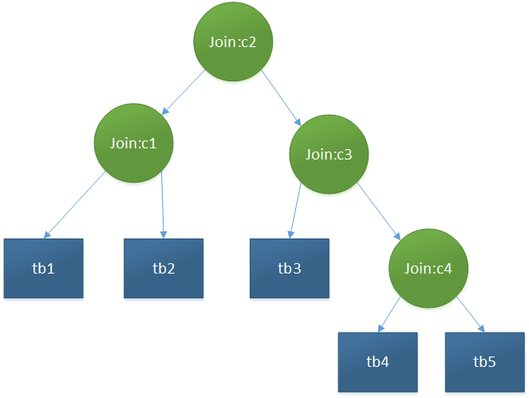
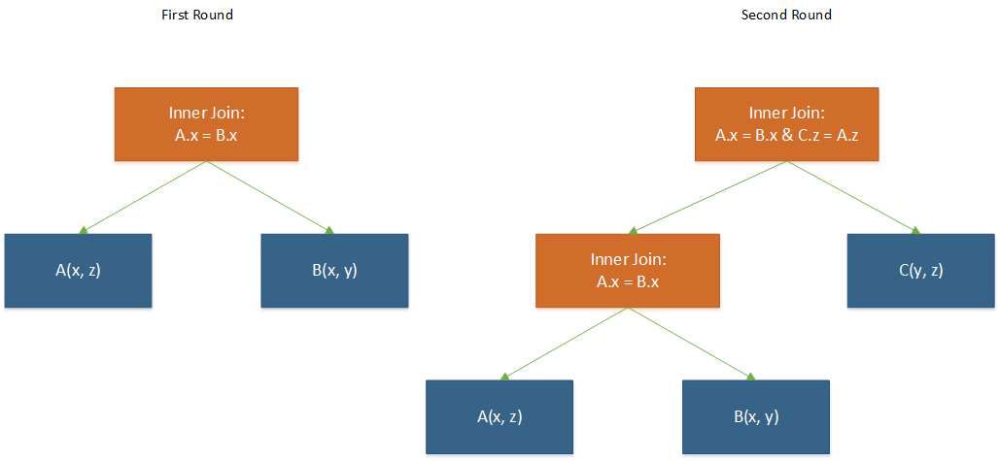

# Spark SQL Join 解析

本文讲的是将from语句块解析成Join的LogicalPlan。

## 从AST到Unresolved LogicalPlan

	//AstBuilder
	override def visitQuerySpecification(
	      ctx: QuerySpecificationContext): LogicalPlan = withOrigin(ctx) {
	    val from = OneRowRelation.optional(ctx.fromClause) {
	      visitFromClause(ctx.fromClause)
	    }
	    withQuerySpecification(ctx, from)
	  }
AstBuilder中引入了ParserUtils，所以其[隐式类](http://docs.scala-lang.org/zh-cn/overviews/core/implicit-classes.html)EnhancedLogicalPlan也被引入了，所以这里有`OneRowRelation.optional`的操作，实际上这是隐式类起的作用。这里主要关注`visitFromClause`的处理。

	//AstBuilder
	override def visitFromClause(ctx: FromClauseContext): LogicalPlan = withOrigin(ctx) {
	    val from = ctx.relation.asScala.map(plan).reduceLeft(Join(_, _, Inner, None))
	    ctx.lateralView.asScala.foldLeft(from)(withGenerate)
	}
	protected def plan(tree: ParserRuleContext): LogicalPlan = typedVisit(tree)
	protected def typedVisit[T](ctx: ParseTree): T = {
	    ctx.accept(this).asInstanceOf[T]
	}
`ctx.accept`之后做了什么操作呢？实际上其最后会调用`visitJoinRelation`。

	//AstBuilder
	override def visitJoinRelation(ctx: JoinRelationContext): LogicalPlan = withOrigin(ctx) {
	    /** Build a join between two plans. */
	    def join(ctx: JoinRelationContext, left: LogicalPlan, right: LogicalPlan): Join = {
	      val baseJoinType = ctx.joinType match {
	        case null => Inner
	        case jt if jt.FULL != null => FullOuter
	        case jt if jt.SEMI != null => LeftSemi
	        case jt if jt.ANTI != null => LeftAnti
	        case jt if jt.LEFT != null => LeftOuter
	        case jt if jt.RIGHT != null => RightOuter
	        case _ => Inner
	      }
	
	      // Resolve the join type and join condition
	      val (joinType, condition) = Option(ctx.joinCriteria) match {
	        case Some(c) if c.USING != null =>
	          val columns = c.identifier.asScala.map { column =>
	            UnresolvedAttribute.quoted(column.getText)
	          }
	          (UsingJoin(baseJoinType, columns), None)
	        case Some(c) if c.booleanExpression != null =>
	          (baseJoinType, Option(expression(c.booleanExpression)))
	        case None if ctx.NATURAL != null =>
	          (NaturalJoin(baseJoinType), None)
	        case None =>
	          (baseJoinType, None)
	      }
	      Join(left, right, joinType, condition)
	    }
	
	    // Handle all consecutive join clauses. ANTLR produces a right nested tree in which the the
	    // first join clause is at the top. However fields of previously referenced tables can be used
	    // in following join clauses. The tree needs to be reversed in order to make this work.
	    var result = plan(ctx.left)
	    var current = ctx
	    while (current != null) {
	      current.right match {
	        case right: JoinRelationContext =>
	          result = join(current, result, plan(right.left))
	          current = right
	        case right =>
	          result = join(current, result, plan(right))
	          current = null
	      }
	    }
	    result
	}
上面的方法做了一件什么事呢？
> 对于from clause中的每个relation，relation的划分是以逗号为标准的，格式类似于`from relation,relation,...`，因为每个relation中通常会有join操作，所以该方法就是把一个relation中的join操作组织成二叉树。`joinCriteria`就是表示ON或USING语句块。传入join方法`ctx`的用于指明该Join操作的类型，是InnerJoin还是OuterJoin。*NATURAL- JOIN是一种特殊类型的EQUI-JOIN，当两张表的Join keys具有相同名字，并且对应的列数据类型相同，所以这里不能用ON关键字。*将所有的join组织成二叉树的过程就是从左边第一个对象开始，向右递归合并。如下面的例子。

设该relation为(tb1 __join__ tb2 __on__ c1) __join__ (tb3 __join__ (tb4 __join__ tb5 __on__ c4) __on__ c3) __on__ c2。那么会生成如下的二叉树。

必须说明**这里生成的Join二叉树中各个节点的join类型是任意的，包括outer join(left,right,full)，semi join等**。
每个relation都会生成一棵Join二叉树，`visitFromClause`中的操作是将这些二叉树再进行合并，只是条件并没有给定，这是因为条件在where语句中。

## 从Unresolved LogicalPlan到Resolved LogicalPlan

Analyzer的Resolution规则集中涉及到resolve Join的规则有：ResolveReferences和ResolveNaturalAndUsingJoin。下面分别说明这三个规则中对Join节点的操作。

	//Analyzer.ResolveReferences.apply
	case j @ Join(left, right, _, _) if !j.duplicateResolved =>
	        j.copy(right = dedupRight(left, right))
这一句的作用是，如果该Join操作有重名属性，即左右子节点的输出属性名集合有重叠，那么就调用`dedupRight`将右子节点对应的Expression用一个新的Expression ID表示，所以虽然同名，但是对应的Expression ID不同，所以可以区分。
> 小技巧：这个新ID的生成是怎么完成的呢？之前以为要自己写一个计数器控制，实际上不是，而是在object NamedExpression中调用`UUID.randomUUID()`就可以生成jvm中全局唯一的ID。

	//Analyzer
	object ResolveNaturalAndUsingJoin extends Rule[LogicalPlan] {
	    override def apply(plan: LogicalPlan): LogicalPlan = plan resolveOperators {
	      case j @ Join(left, right, UsingJoin(joinType, usingCols), condition)
	          if left.resolved && right.resolved && j.duplicateResolved =>
	        // Resolve the column names referenced in using clause from both the legs of join.
	        val lCols = usingCols.flatMap(col => left.resolveQuoted(col.name, resolver))
	        val rCols = usingCols.flatMap(col => right.resolveQuoted(col.name, resolver))
	        if ((lCols.length == usingCols.length) && (rCols.length == usingCols.length)) {
	          val joinNames = lCols.map(exp => exp.name)
	          commonNaturalJoinProcessing(left, right, joinType, joinNames, None)
	        } else {
	          j
	        }
	      case j @ Join(left, right, NaturalJoin(joinType), condition) if j.resolvedExceptNatural =>
	        // find common column names from both sides
	        val joinNames = left.output.map(_.name).intersect(right.output.map(_.name))
	        commonNaturalJoinProcessing(left, right, joinType, joinNames, condition)
	    }
	}
从上面的代码可以看出USING块是一种特殊的Natural Join，Natural Join使用的Join key就是两个Relation的相同属性，而USING块是指定了Join key（两个Relation共同拥有）的Natural Join。上面的规则作用是：

1. 对USING块指定的Join key进行验证，可能存在不满足“两个Relation共同拥有”这一条件。
2. 由于Natural Join没有指明Join Key，在这里进行指明。

`commonNaturalJoinProcessing`生成的是Projection节点（包含投影Join后的输出和Join节点），而且增加了`condition`（之前为None），并且解析出了左右Join Key的Attribute对象。
[之前](https://github.com/summerDG/spark-code-ananlysis/blob/master/analysis/sql/spark_sql_parser.md)介绍过，这些规则集有负责将属性绑定到真是的数据集上。

## LogicalPlan Optimize

在Optimizer的优化规则里与Join算子关系较为密切的规则有：PushPredicateThroughJoin、ReorderJoin和EliminateOuterJoin。
本文着重关注InnerJoin，所以EliminateOuterJoin不介绍。

### PushPredicateThroughJoin

该优化规则是将Filter中的条件下移到Join算子中。

1. 当Filter中的条件只需要Join中的left child或right child的输出属性求出来，就更新该节点。以InnerJoin为例（本文只关注InnerJoin）

		//PushPredicateThroughJoin.apply
		case f @ Filter(filterCondition, Join(left, right, joinType, joinCondition)) =>
		      val (leftFilterConditions, rightFilterConditions, commonFilterCondition) =
		        split(splitConjunctivePredicates(filterCondition), left, right)
		      joinType match {
		        case Inner =>
		          // push down the single side `where` condition into respective sides
		          val newLeft = leftFilterConditions.
		            reduceLeftOption(And).map(Filter(_, left)).getOrElse(left)
		          val newRight = rightFilterConditions.
		            reduceLeftOption(And).map(Filter(_, right)).getOrElse(right)
		          val (newJoinConditions, others) =
		            commonFilterCondition.partition(e => !SubqueryExpression.hasCorrelatedSubquery(e))
		          val newJoinCond = (newJoinConditions ++ joinCondition).reduceLeftOption(And)
		
		          val join = Join(newLeft, newRight, Inner, newJoinCond)
		          if (others.nonEmpty) {
		            Filter(others.reduceLeft(And), join)
		          } else {
		            join
		         }
				  ...
		}
	其中`split`方法是将Filter算子（Where块）中的条件分为3部分：1）可以通过Join的左节点直接求值的；2）可以通过有节点直接求值的；3）涉及到两个子节点的属性，必须通过两个节点求值的，或者其他属性（如子查询）。

	然后针对前两种情况直接在子节点上面生成Filter节点。

	对于第3种情况，首先会将该部分的条件分为两部分，非子查询条件或子查询条件（子查询条件值得是必须等该Join操作完成之后才能执行的过滤条件，e.g.IN，BETWEEN等算子）。这里主要关注非子查询条件，因为这部分和Join有关。非子查询条件说明是涉及到左右两个子节点的属性，所以理应加到Join的连接条件当中。所以这里会将这部分条件与原来Join中的连接条件连接到一起生成新的Join条件。
	
	最后，如果子查询条件为空，就直接返回Join节点，省去了Filter节点（减少了一次算子的运行）。反之将子查询条件作为Filter的新条件，向下连接Join节点。这一步同时处理了fromClause中不同relation之间连接的问题（之前只是生成Join节点，但并没有连接条件）。

2. 只是将Join节点中的连接条件下移到左右子节点。即如果连接条件中的部分条件可以完全由左（右）子节点求值，就没必要将其放到Join的判断条件中，毕竟Join关注的应该是和Shuffle相关的条件才对。这部分代码类似于1中的前半部分，所以就不贴了。

### ReorderJoin

该规则只对InnerJoin进行重新排序，把所有的条件表达式分配到join的子树中，使每个叶子节点至少有一个条件表达式。

	//ReorderJoin in joins.scala
	def apply(plan: LogicalPlan): LogicalPlan = plan transform {
	    case j @ ExtractFiltersAndInnerJoins(input, conditions)
	        if input.size > 2 && conditions.nonEmpty =>
	      createOrderedJoin(input, conditions)
	}
ExtractFiltersAndInnerJoin并不是一个节点，而是一种具体形式的子树，实际上该类的作用就是“解构”子树，并无其他作用，所以其被调用到的方法只有`unapply`。这棵子树的结构就是Filter和InnerJoin交替出现。该规则的作用就是：

          Filter
            |
        inner Join
          /    \            ---->      (Seq(plan0, plan1, plan2), conditions)
      Filter   plan2
        |
	 inner join
      /    \
	plan0   plan1
`conditions`中条件的顺序是bottom-up的，这里的条件表达式包括Join中的连接条件，也包含Filter中的条件，所以这两类条件从底到顶交替出现。
下面看如何对这棵子树中的各个节点排序。

	//ReorderJoin in joins.scala
	def createOrderedJoin(input: Seq[LogicalPlan], conditions: Seq[Expression]): LogicalPlan = {
	    assert(input.size >= 2)
	    if (input.size == 2) {
	      ...
	    } else {
	      val left :: rest = input.toList
	      // find out the first join that have at least one join condition
	      val conditionalJoin = rest.find { plan =>
	        val refs = left.outputSet ++ plan.outputSet
	        conditions.filterNot(canEvaluate(_, left)).filterNot(canEvaluate(_, plan))
	          .exists(_.references.subsetOf(refs))
	      }
	      // pick the next one if no condition left
	      val right = conditionalJoin.getOrElse(rest.head)
	
	      val joinedRefs = left.outputSet ++ right.outputSet
	      val (joinConditions, others) = conditions.partition(
	        e => e.references.subsetOf(joinedRefs) && !SubqueryExpression.hasCorrelatedSubquery(e))
	      val joined = Join(left, right, Inner, joinConditions.reduceLeftOption(And))
	
	      // should not have reference to same logical plan
	      createOrderedJoin(Seq(joined) ++ rest.filterNot(_ eq right), others)
	    }
	}
子plan数目为2的时候，说明最多只有一个个Join，其操作类似于之前PushPredicateThroughJoin的操作，这里省去。如果有多个Join，将plan序列分为两部分：left和rest。从rest中找到第一个与`left`有join关系的plan（即代码中的`right`）。找到后按照是否是这两个节点（`left`和`right`）输出属性的子集，将判断条件分为两部分，一部分是与这两个plan都相关的，另一部分就是其他。最后生成新的Join节点，然后递归操作。那么这个操作作用怎么体现呢？对于普通链式和星形的multi-way join操作似乎没有作用，但是对于环形的操作就会有效。举例：a(x, y, z) <- A(x, z), B(x, y), C(y, z)。

