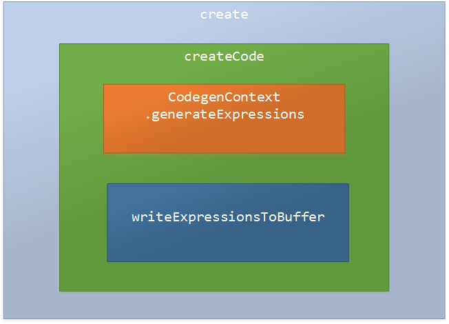

# Spark SQL Join

之前分析过SQL的总体执行过程，但是介绍的是大体思路。本文主要关注的是Join的具体执行。

## LogicalPlan到PhysicalPlan

从LogicalPlan进行分析，Join操作的LogicalPlan有多种类型，主要包含ExtractEquiJoinKeys，Logical.Join类型。从PhysicalPlan中的JoinSelection入手来看。

	//SparkStrategies.JoinSelection
	def apply(plan: LogicalPlan): Seq[SparkPlan] = plan match {
	...
	      case ExtractEquiJoinKeys(joinType, leftKeys, rightKeys, condition, left, right)
	        if RowOrdering.isOrderable(leftKeys) =>
	        joins.SortMergeJoinExec(
	          leftKeys, rightKeys, joinType, condition, planLater(left), planLater(right)) :: Nil
	
	      // --- Without joining keys ------------------------------------------------------------
	
	      // Pick BroadcastNestedLoopJoin if one side could be broadcasted
	      case j @ logical.Join(left, right, joinType, condition)
	          if canBuildRight(joinType) && canBroadcast(right) =>
	        joins.BroadcastNestedLoopJoinExec(
	          planLater(left), planLater(right), BuildRight, joinType, condition) :: Nil
	      case j @ logical.Join(left, right, joinType, condition)
	          if canBuildLeft(joinType) && canBroadcast(left) =>
	        joins.BroadcastNestedLoopJoinExec(
	          planLater(left), planLater(right), BuildLeft, joinType, condition) :: Nil
	
	      // Pick CartesianProduct for InnerJoin
	      ...
	    }
	  }

ExtractEquiJoinKeys主要是用于equi-Join，而没有Join key或者Inner-Join的时候会用Logical.Join。以常见的equi-Join为对象，即ExtractEquiJoinKeys，进行分析。

	//pattern.scala
	object ExtractEquiJoinKeys extends Logging with PredicateHelper {
	  /** (joinType, leftKeys, rightKeys, condition, leftChild, rightChild) */
	  type ReturnType =
	    (JoinType, Seq[Expression], Seq[Expression], Option[Expression], LogicalPlan, LogicalPlan)
	
	  def unapply(plan: LogicalPlan): Option[ReturnType] = plan match {
	    case join @ Join(left, right, joinType, condition) =>
	      logDebug(s"Considering join on: $condition")
	      // Find equi-join predicates that can be evaluated before the join, and thus can be used
	      // as join keys.
	      val predicates = condition.map(splitConjunctivePredicates).getOrElse(Nil)
	      val joinKeys = predicates.flatMap {
	        case EqualTo(l, r) if canEvaluate(l, left) && canEvaluate(r, right) => Some((l, r))
	        case EqualTo(l, r) if canEvaluate(l, right) && canEvaluate(r, left) => Some((r, l))
	        // Replace null with default value for joining key, then those rows with null in it could
	        // be joined together
	        case EqualNullSafe(l, r)...
	        case other => None
	      }
	      val otherPredicates = predicates.filterNot {
	        case EqualTo(l, r) =>
	          canEvaluate(l, left) && canEvaluate(r, right) ||
	            canEvaluate(l, right) && canEvaluate(r, left)
	        case other => false
	      }
	
	      if (joinKeys.nonEmpty) {
	        val (leftKeys, rightKeys) = joinKeys.unzip
	        logDebug(s"leftKeys:$leftKeys | rightKeys:$rightKeys")
	        Some((joinType, leftKeys, rightKeys, otherPredicates.reduceOption(And), left, right))
	      } else {
	        None
	      }
	    case _ => None
		}
	  }

首先就是针对Join操作中的连接条件进行提取，如果是Equi-Join，就将左右子节点的Join Key都提取出来。这里有两种情况：EqualTo和EqualNullSafe，这两者的区别在于对空值是否敏感。EqualTo对空值是敏感的，也就是说对于空值没有额外的处理，而EqualNullSafe情况下的处理逻辑基本和EqualTo一样，但是它会对空值做处理，即赋予相应类型的默认值。那么什么情况下会使用这两种情况呢？实际是用户指定的，条件表达式为“=”或“==”时使用EqualTo，当为“<=>”使用EqualNullSafe。
`otherPredicates`是记录除了EqualTo类型之外的条件表达式，这里主要是除EqualTo之外的表达式（求值），还有就是EqualNullSafe表达式（这里将EqualNullSafe再次加入`otherPredicates`的目的是）。之后生成的结果就是提取出来的Equi-Join Key，并且把其他连接条件也提取出来。

> Note: Spark SQL暂时没有实现Theta Join（真是高看它了，Hive也没有实现，09年就提出了，PR已提交，但至今没解决），但是范围约束之前的Logical Plan优化是处理过一次的，这里是另一部分，即那些不能马上得出的，如求值表达式（至于IN，BETWEEN等在不在里边，暂时不确定）。

所以`otherPredicates`中的内容基本上可以Shuffle之后在各个数据集上分别处理。

由于在没有特殊设置的情况下会调用SortMergeJoin，所以进入SortMergeJoinExec，传入的参数包括left child和right child，以及对应的join key，还有约束条件。

Shuffle的操作是[执行](https://github.com/spafka/spark/tree/master/MDZ/3rd/analysis/sql/spark_sql_execution.md)的时候添加的。在EnsureRequirements的`ensureDistributionAndOrdering`会获取Join的分布策略，该策略是通过`requiredChildDistribution`获取的。

	//SortMergeJoinExec
	override def requiredChildDistribution: Seq[Distribution] =
	    ClusteredDistribution(leftKeys) :: ClusteredDistribution(rightKeys) :: Nil
可以发现每个ClusteredDistribution只包含一个key，并且通过源码，实际上每个child RDD对应一个ClusteredDistribution。所以可以猜想每个ClusteredDistribution应该是用于shuffle时的partition id的计算。

>RDD在进行Shuffle的时候会输入必须是一个Product[K,V]的形式，所以RDD中的记录必须转成这种格式。那么SQL DataSet中的数据类型是InternalRow，哪来的key呢？实际上在DataSet中，这个Key就是Partition Id。在进行真正的Shuffle之前，其实已经计算好了对应的Partition Id。

## PhysicalPlan到执行

	//EnsureRequirements
	private def ensureDistributionAndOrdering(operator: SparkPlan): SparkPlan = {
	    val requiredChildDistributions: Seq[Distribution] = operator.requiredChildDistribution
	    val requiredChildOrderings: Seq[Seq[SortOrder]] = operator.requiredChildOrdering
	    assert(requiredChildDistributions.length == operator.children.length)
	    assert(requiredChildOrderings.length == operator.children.length)
	
	    def createShuffleExchange(dist: Distribution, child: SparkPlan) =
	      ShuffleExchange(createPartitioning(dist, defaultNumPreShufflePartitions), child)
	
	    var (parent, children) = operator match {
	      ...
	      case _ =>
	        ...
	          case (child, distribution) =>
	            createShuffleExchange(distribution, child)
	        }
	        (operator, newChildren)
	    }
	  }
	  private def createPartitioning(
	      requiredDistribution: Distribution,
	      numPartitions: Int): Partitioning = {
	    requiredDistribution match {
	      case AllTuples => SinglePartition
	      case ClusteredDistribution(clustering) => HashPartitioning(clustering, numPartitions)
	      case OrderedDistribution(ordering) => RangePartitioning(ordering, numPartitions)
	      case dist => sys.error(s"Do not know how to satisfy distribution $dist")
	    }
	  }
	 
回顾EnsureRequirements，这次关注的是ShuffleExchange和Partitioning。构造ShuffleExchange之前首先要构造Partitioning。Partitioning本质上就是一个以数据为输入（InternalRow类型），输出为partition id的表达式。

> 上面的函数还用于生成排序节点，join操作实际上是要先shuffle，然后排序，最后找相同的key，Shuffle操作由ShuffleExchange节点完成，虽说Spark使用的是sortPartition进行Shuffle，但这里的Sort并不会保证partition内部的数据有序，其只是保证Shuffle时各个Partititon之间是有序的。所以这里还要增加SortExec节点，也就是说在原本child节点上面增加了两层父节点，先是把结果传给ShuffleExchange进行Shuffle，然后再传给SortExec节点进行排序。

ShuffleExchange只是合并了Partitioning和对应child RDD。这样RDD就可以通过Partitioning生成对应的partition id了。上面提到额Distribution最主要的作用就是生成对应的Partitioning，真正用于计算Partition id的是Partitioning，而非Distribution，可以把Distribution当做计算Partitioning的参数集合。

	//ShuffleExchange
	def getPartitionKeyExtractor(): InternalRow => Any = newPartitioning match {
	      ...
	      case h: HashPartitioning =>
	        val projection = UnsafeProjection.create(h.partitionIdExpression :: Nil, outputAttributes)
	        row => projection(row).getInt(0)
	      ...
	  }
Partitoning的子类包含：BroadcastPartitioning，RoundRobinPartitioning，HashPartitionning和RangePartitioning等。前面已经看到，ClusteredDistribution对应的是HashPartitionning。`UnsafeProjection.create`是根据Partitioning生成表达式。
	
	//HashPartitioning
	def partitionIdExpression: Expression = Pmod(new Murmur3Hash(expressions), Literal(numPartitions))
	
	//Projection.UnsafeProjection
	def create(exprs: Seq[Expression], inputSchema: Seq[Attribute]): UnsafeProjection = {
	    create(exprs.map(BindReferences.bindReference(_, inputSchema)))
	}
	def create(exprs: Seq[Expression]): UnsafeProjection = {
	    val unsafeExprs = exprs.map(_ transform {
	      case CreateStruct(children) => CreateStructUnsafe(children)
	      case CreateNamedStruct(children) => CreateNamedStructUnsafe(children)
	    })
	    GenerateUnsafeProjection.generate(unsafeExprs)
	}
大可先将Pmod认为就是mod，输入数据，计算hash value，求模，计算出Partition id。`UnsafeProjection.create`中首先对Pmod类型的Expression做处理，将Pmod中的所有变量同需要输出的Attribute进行绑定，因为只有绑定之后处理的对象才会是RDD中记录的具体位置。然后就是调用`GenerateUnsafeProjection.generate`生成投影表达式，根据输入的row，输出投影后InternalRow。这个函数主要的作用调用`create`codegen对应的代码。

	//GenerateUnsafeProjection
	private def create(
	      expressions: Seq[Expression],
	      subexpressionEliminationEnabled: Boolean): UnsafeProjection = {
	    val ctx = newCodeGenContext()
	    val eval = createCode(ctx, expressions, subexpressionEliminationEnabled)
	
	    val codeBody = s"""
	      public java.lang.Object generate(Object[] references) {
	        return new SpecificUnsafeProjection(references);
	      }
	
	      class SpecificUnsafeProjection extends ${classOf[UnsafeProjection].getName} {
	
	        private Object[] references;
	        ...
	
	        // Scala.Function1 need this
	        public java.lang.Object apply(java.lang.Object row) {
	          return apply((InternalRow) row);
	        }
	
	        public UnsafeRow apply(InternalRow ${ctx.INPUT_ROW}) {
	          ${eval.code.trim}
	          return ${eval.value};
	        }
	      }
	      """
	
	    val code = CodeFormatter.stripOverlappingComments(
	      new CodeAndComment(codeBody, ctx.getPlaceHolderToComments()))
	    logDebug(s"code for ${expressions.mkString(",")}:\n${CodeFormatter.format(code)}")
	
	    val c = CodeGenerator.compile(code)
	    c.generate(ctx.references.toArray).asInstanceOf[UnsafeProjection]
	}
	def createCode(
	      ctx: CodegenContext,
	      expressions: Seq[Expression],
	      useSubexprElimination: Boolean = false): ExprCode = {
	    val exprEvals = ctx.generateExpressions(expressions, useSubexprElimination)
	    ...
	
	    val writeExpressions =
	      writeExpressionsToBuffer(ctx, ctx.INPUT_ROW, exprEvals, exprTypes, holder, isTopLevel = true)
	
	    val code =
	      s"""
	        $resetBufferHolder
	        $evalSubexpr
	        $writeExpressions
	        $updateRowSize
	      """
	    ExprCode(code, "false", result)
	}
	private def writeExpressionsToBuffer(
	      ctx: CodegenContext,
	      row: String,
	      inputs: Seq[ExprCode],
	      inputTypes: Seq[DataType],
	      bufferHolder: String,
	      isTopLevel: Boolean = false): String = {
	    ...
	    val writeFields = inputs.zip(inputTypes).zipWithIndex.map {
	      case ((input, dataType), index) =>
	        ...
	        val writeField = dt match {
			...
	          case _ => s"$rowWriter.write($index, ${input.value});"
	        }
	
	        if (input.isNull == "false") {
	          s"""
	            ${input.code}
	            ${writeField.trim}
	          """
	        } else {
	          ...
	    }
	
	    s"""
	      $resetWriter
	      ${ctx.splitExpressions(row, writeFields)}
	    """.trim
	}

这部分复杂的代码主要功能就是利用表达式（Pmod）生成用于把row（InternalRow）生成下一个InternalRow的代码，简而言之，这是一个类似InternalRow=>InternalRow的函数，不同的是，结果的InternalRow中的对象只有Partition id。

代码只保留最核心的代码，调用关系如下图。

`$rowWriter.write($index, ${input.value});`这句将表达式计算的结果写入RDD，这里最终每条结果的类型是UnsafeRow，但是只保存一个field，即partition id。所以在ShuffleExchange的`getPartitionKeyExtractor()`中执行`projection(row).getInt(0)`就可以获取到Partition Id。
获取到partition id后，生成ShuffleDependency（在ShuffleExchange的prepareShuffleDependency中）。这个对象之后被传入doExcute中。

	//ShuffleExchange
	protected override def doExecute(): RDD[InternalRow] = attachTree(this, "execute") {
	    // Returns the same ShuffleRowRDD if this plan is used by multiple plans.
	    if (cachedShuffleRDD == null) {
	      cachedShuffleRDD = coordinator match {
	        case Some(exchangeCoordinator) =>
	          ...
	        case None =>
	          val shuffleDependency = prepareShuffleDependency()
	          preparePostShuffleRDD(shuffleDependency)
	      }
	    }
	    cachedShuffleRDD
	}
	private[exchange] def preparePostShuffleRDD(
	      shuffleDependency: ShuffleDependency[Int, InternalRow, InternalRow],
	      specifiedPartitionStartIndices: Option[Array[Int]] = None): ShuffledRowRDD = {
	   ...
	    new ShuffledRowRDD(shuffleDependency, specifiedPartitionStartIndices)
	}
得知Dependency，并转化为RDD之后，处理过程就和RDD的操作一样了（遇到action操作触发生成RDD）。忙活了大半天，其实就是在生成Dependency。所以Spark SQL绝大部分工作也只是生成RDD的dependency。
