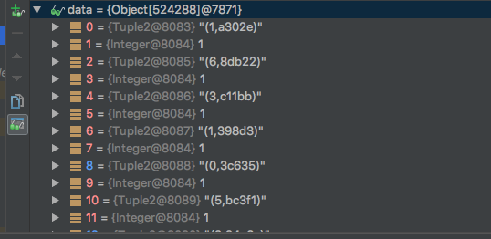

分布式系统里的Shuffle 阶段往往是非常复杂的，而且分支条件也多，我只能按着我关注的线去描述。肯定会有不少谬误之处，我会根据自己理解的深入，不断更新这篇文章。

前言


shuffle共有三种，别人讨论的是hash shuffle，这是最原始的实现，曾经有两个版本，第一版是每个map产生r个文件，一共产生mr个文件，由于产生的中间文件太大影响扩展性，社区提出了第二个优化版本，让一个core上map共用文件，减少文件数目，这样共产生corer个文件，好多了，但中间文件数目仍随任务数线性增加，仍难以应对大作业，但hash shuffle已经优化到头了。为了解决hash shuffle性能差的问题，又引入sort shuffle，完全借鉴mapreduce实现，每个map产生一个文件，彻底解决了扩展性问题

目前Sort Based Shuffle 是作为默认Shuffle类型的。Shuffle 是一个很复杂的过程，任何一个环节都足够写一篇文章。所以这里，我尝试换个方式，从实用的角度出发，让读者有两方面的收获：

剖析哪些环节，哪些代码可能会让内存产生问题
控制相关内存的参数
有时候，我们宁可程序慢点，也不要OOM，至少要先跑步起来，希望这篇文章能够让你达成这个目标。

同时我们会提及一些类名，这些类方便你自己想更深入了解时，可以方便的找到他们，自己去探个究竟。

Shuffle 概览
Spark 的Shuffle 分为 Write,Read 两阶段。我们预先建立三个概念：

Write 对应的是ShuffleMapTask,具体的写操作ExternalSorter来负责

Read 阶段由ShuffleRDD里的HashShuffleReader来完成。如果拉来的数据如果过大，需要落地，则也由ExternalSorter来完成的

所有Write 写完后，才会执行Read。 他们被分成了两个不同的Stage阶段。

也就是说，Shuffle Write ,Shuffle Read 两阶段都可能需要落磁盘，并且通过Disk Merge 来完成最后的Sort归并排序。

Shuffle Write 内存消耗分析
Shuffle Write 的入口链路为：

org.apache.spark.scheduler.ShuffleMapTask
---> org.apache.spark.shuffle.sort.SortShuffleWriter 
   ---> org.apache.spark.util.collection.ExternalSorter
会产生内存瓶颈的其实就是 org.apache.spark.util.collection.ExternalSorter。我们看看这个复杂的ExternalSorter都有哪些地方在占用内存：


ShuffleMapTask::runTask
```scala
 override def runTask(context: TaskContext): MapStatus = {
    // Deserialize the RDD using the broadcast variable.
    val threadMXBean = ManagementFactory.getThreadMXBean
    val deserializeStartTime = System.currentTimeMillis()
    val deserializeStartCpuTime = if (threadMXBean.isCurrentThreadCpuTimeSupported) {
      threadMXBean.getCurrentThreadCpuTime
    } else 0L
    val ser = SparkEnv.get.closureSerializer.newInstance()
    val (rdd, dep) = ser.deserialize[(RDD[_], ShuffleDependency[_, _, _])](
      ByteBuffer.wrap(taskBinary.value), Thread.currentThread.getContextClassLoader)
    _executorDeserializeTime = System.currentTimeMillis() - deserializeStartTime
    _executorDeserializeCpuTime = if (threadMXBean.isCurrentThreadCpuTimeSupported) {
      threadMXBean.getCurrentThreadCpuTime - deserializeStartCpuTime
    } else 0L


    // fixme todo
    var writer: ShuffleWriter[Any, Any] = null
    try {
      val manager = SparkEnv.get.shuffleManager
      writer = manager.getWriter[Any, Any](dep.shuffleHandle, partitionId, context)


      logInfo(
        s"""
           |+---------------------------------+
           ||   ***** SPARK SHUFFLE  *****
           ||   shuffleId = ${dep.shuffleId}
           ||   rdd=${rdd}
           ||   partitionId=${partitionId}
           ||   writer = ${writer.getClass.getSimpleName}
           |+---------------------------------+
       """.stripMargin)
      writer.write(rdd.iterator(partition, context).asInstanceOf[Iterator[_ <: Product2[Any, Any]]])
      writer.stop(success = true).get
    } catch {
      case e: Exception =>
        try {
          if (writer != null) {
            writer.stop(success = false)
          }
        } catch {
          case e: Exception =>
            log.debug("Could not stop writer", e)
        }
        throw e
    }
  }
```

spark 2 以后默认使用的是SortShuffleWriter,在map端，有aggerator，会进行完整的一次combiner，接着reduce还会在进行一次完整的combiner
而对于sort，先采用tearsort采样分区的临界值，随后reduce端读取远程数据，进行排序，排序主要在reduce端
SortShuffleWriter最终会把所有spilled文件合成一个sortBase的file。
SortShuffleWriter::write
```scala
/** Write a bunch of records to this task's output */
  override def write(records: Iterator[Product2[K, V]]): Unit = {

   // 外部排序器，根据是否有聚合，其insertAll方法也会不一样，一般combineByKeyWithClasssTag会有aggerator，sortByKey带ordering，不过map端是采用terasort分区，reduce端才会ordering
   // groupBy 则不会带aggerator，因为不需要在map端聚合
    sorter = if (dep.mapSideCombine) {
      require(dep.aggregator.isDefined, "Map-side combine without Aggregator specified!")
      new ExternalSorter[K, V, C](
        context, dep.aggregator, Some(dep.partitioner), dep.keyOrdering, dep.serializer)
    } else {
      // In this case we pass neither an aggregator nor an ordering to the sorter, because we don't
      // care whether the keys get sorted in each partition; that will be done on the reduce side
      // if the operation being run is sortByKey.
      new ExternalSorter[K, V, V](
        context, aggregator = None, Some(dep.partitioner), ordering = None, dep.serializer)
    }
    sorter.insertAll(records)

    // Don't bother including the time to open the merged output file in the shuffle write time,
    // because it just opens a single file, so is typically too fast to measure accurately
    // (see SPARK-3570).
    val output = shuffleBlockResolver.getDataFile(dep.shuffleId, mapId)
    val tmp = Utils.tempFileWith(output)
    try {
      val blockId = ShuffleBlockId(dep.shuffleId, mapId, IndexShuffleBlockResolver.NOOP_REDUCE_ID)
      val partitionLengths = sorter.writePartitionedFile(blockId, tmp)
      shuffleBlockResolver.writeIndexFileAndCommit(dep.shuffleId, mapId, partitionLengths, tmp)
      mapStatus = MapStatus(blockManager.shuffleServerId, partitionLengths)
    } finally {
      if (tmp.exists() && !tmp.delete()) {
        logError(s"Error while deleting temp file ${tmp.getAbsolutePath}")
      }
    }
  }
```


```scala
  def insertAll(records: Iterator[Product2[K, V]]): Unit = {
    // TODO: stop combining if we find that the reduction factor isn't high
    val shouldCombine = aggregator.isDefined
    // 是否需要聚合
    if (shouldCombine) {
      // Combine values in-memory first using our AppendOnlyMap
      val mergeValue = aggregator.get.mergeValue
      val createCombiner = aggregator.get.createCombiner
      var kv: Product2[K, V] = null


      // val createCombiner = (v: Int) => v
      // val mergeValue = (c: Int, v: Int) => c + v
      // val mergeCombiners = (c1: Int, c2: Int) => c1 + c2
      //  word count 对于值的更新，合成一个combiner ，在map里的data操作
      val update = (hadValue: Boolean, oldValue: C) => {
        if (hadValue) mergeValue(oldValue, kv._2) else createCombiner(kv._2)
      }
      while (records.hasNext) {
        addElementsRead()
        kv = records.next()
        // 更新data里的数据
        map.changeValue((getPartition(kv._1), kv._1), update)
        // maybe spill
        maybeSpillCollection(usingMap = true)
      }
    } else {
      // Stick values into our buffer
      while (records.hasNext) {
        addElementsRead()
        val kv = records.next()
        buffer.insert(getPartition(kv._1), kv._1, kv._2.asInstanceOf[C])
        maybeSpillCollection(usingMap = false)
      }
    }
  }
```
第一个地：
ExternalSorter
```scala
private var map = new PartitionedAppendOnlyMap[K, C]
```

我们知道，数据都是先写内存，内存不够了，才写磁盘。这里的map就是那个放数据的内存了。

这个PartitionedAppendOnlyMap内部维持了一个数组，是这样的：

AppendOnlyMap
```scala
// Holds keys and values in the same array for memory locality; specifically, the order of
  // elements is key0, value0, key1, value1, key2, value2, etc.
  private var data = new Array[AnyRef](2 * capacity)
```

也就是他消耗的并不是Storage的内存，所谓Storage内存，指的是由blockManager管理起来的内存。


数据读取流程，读取iter里的内容，溢出时写到磁盘
```scala
  while (records.hasNext) {
          addElementsRead()
          kv = records.next()
          // 更新data里的数据
          map.changeValue((getPartition(kv._1), kv._1), update)
          // maybe spill
          maybeSpillCollection(usingMap = true)
        }
        
        
   override def changeValue(key: K, updateFunc: (Boolean, V) => V): V = {
            val newValue = super.changeValue(key, updateFunc)
            super.afterUpdate()
            newValue
          }
          
    
   protected def afterUpdate(): Unit = {
              numUpdates += 1
              if (nextSampleNum == numUpdates) {
                takeSample()
              }
    }
```

AppendOnlyMap::changeValue 更新数据
```scala

   def changeValue(key: K, updateFunc: (Boolean, V) => V): V = {
      assert(!destroyed, destructionMessage)
      val k = key.asInstanceOf[AnyRef]
      // 对null的特殊处理
      if (k.eq(null)) {
        if (!haveNullValue) {
          incrementSize()
        }
        nullValue = updateFunc(haveNullValue, nullValue)
        haveNullValue = true
        return nullValue
      }
      var pos: Int = rehash(k.hashCode) & mask
      var i = 1
  
      // 更新值得逻辑为，如果data[pos]为空，则使用createBiner，如果两个值相等，
      // 则要使用mergeValue，聚合之，否则移动pos，直到满足前面两个条件成立，结束
      while (true) {
        val curKey = data(2 * pos)
        if (curKey.eq(null)) {
          val newValue = updateFunc(false, null.asInstanceOf[V])
          data(2 * pos) = k
          data(2 * pos + 1) = newValue.asInstanceOf[AnyRef]
          incrementSize()
          return newValue
        } else if (k.eq(curKey) || k.equals(curKey)) {
          val newValue = updateFunc(true, data(2 * pos + 1).asInstanceOf[V])
          data(2 * pos + 1) = newValue.asInstanceOf[AnyRef]
          return newValue
        } else {
          val delta = i
          pos = (pos + delta) & mask
          i += 1
        }
      }
      null.asInstanceOf[V] // Never reached but needed to keep compiler happy
    }
```
PartitionedAppendOnlyMap extends  SizeTrackingAppendOnlyMap ，所以其含有对data长度的侦查能力，当到达更新次数时，从新对数据采样，以此估算data的内存，从而判断是否刷盘操作
```scala

  /**
   * Callback to be invoked after every update.
   */
  protected def afterUpdate(): Unit = {
    numUpdates += 1
    if (nextSampleNum == numUpdates) {
      takeSample()
    }
  }

  /**
   * Take a new sample of the current collection's size.
   */
  private def takeSample(): Unit = {
    samples.enqueue(Sample(SizeEstimator.estimate(this), numUpdates))
    // Only use the last two samples to extrapolate
    if (samples.size > 2) {
      samples.dequeue()
    }
    val bytesDelta = samples.toList.reverse match {
      case latest :: previous :: tail =>
        (latest.size - previous.size).toDouble / (latest.numUpdates - previous.numUpdates)
      // If fewer than 2 samples, assume no change
      case _ => 0
    }
    bytesPerUpdate = math.max(0, bytesDelta)
    nextSampleNum = math.ceil(numUpdates * SAMPLE_GROWTH_RATE).toLong
  }
  
```

刷盘有两种，一种是map，还有一种是buffer ,map里的data数据是聚合的，而buffer则针对没有聚合的普通shuffle  ref: ExteralSorter::insertAll
ExternalSorter::maybeSpillCollection
```scala
 /**
   * Spill the current in-memory collection to disk if needed.
   *
   * @param usingMap whether we're using a map or buffer as our current in-memory collection
   */
  private def maybeSpillCollection(usingMap: Boolean): Unit = {
    var estimatedSize = 0L
    if (usingMap) {
      estimatedSize = map.estimateSize()
      if (maybeSpill(map, estimatedSize)) {
        map = new PartitionedAppendOnlyMap[K, C]
      }
    } else {
      estimatedSize = buffer.estimateSize()
      if (maybeSpill(buffer, estimatedSize)) {
        buffer = new PartitionedPairBuffer[K, C]
      }
    }

    if (estimatedSize > _peakMemoryUsedBytes) {
      _peakMemoryUsedBytes = estimatedSize
    }
  }
```
判断是否集合数据是否到达内存的heap上限，内存太大了，为了避免OOM，直接刷盘
Spillable::maybeSpill
```scala
 protected def maybeSpill(collection: C, currentMemory: Long): Boolean = {
    var shouldSpill = false
    if (elementsRead % 32 == 0 && currentMemory >= myMemoryThreshold) {
      // Claim up to double our current memory from the shuffle memory pool
      val amountToRequest = 2 * currentMemory - myMemoryThreshold
      val granted = acquireMemory(amountToRequest)
      myMemoryThreshold += granted
      // If we were granted too little memory to grow further (either tryToAcquire returned 0,
      // or we already had more memory than myMemoryThreshold), spill the current collection
      shouldSpill = currentMemory >= myMemoryThreshold
    }
    shouldSpill = shouldSpill || _elementsRead > numElementsForceSpillThreshold
    // Actually spill
    if (shouldSpill) {
      _spillCount += 1
      
      logInfo(
        s"""+-----------------------------------------+
           || ****  SPARK SHUFFLE  *****
           || ${logSpillage(currentMemory)}
           |+-----------------------------------------+
         """.stripMargin)
      // 刷盘
      spill(collection)
      _elementsRead = 0
      _memoryBytesSpilled += currentMemory
      releaseMemory()
    }
    shouldSpill
  }
```
AppendOnlyMap::spill
```scala
/**
   * Spill our in-memory collection to a sorted file that we can merge later.
   * We add this file into `spilledFiles` to find it later.
   *
   * @param collection whichever collection we're using (map or buffer)
   */
  override protected[this] def spill(collection: WritablePartitionedPairCollection[K, C]): Unit = {
    
    // 是一个按分区排序的迭代器，具体使用timsort排序data之后，返回一个iter，iter含分区ID
    val inMemoryIterator = collection.destructiveSortedWritablePartitionedIterator(comparator)
    // 
    val spillFile = spillMemoryIteratorToDisk(inMemoryIterator)
    spills += spillFile
  }
```
AppendOnlyMap::destructiveSortedIterator
```scala
  /**
   * Return an iterator of the map in sorted order. This provides a way to sort the map without
   * using additional memory, at the expense of destroying the validity of the map.
   */
  def destructiveSortedIterator(keyComparator: Comparator[K]): Iterator[(K, V)] = {
    destroyed = true
    // Pack KV pairs into the front of the underlying array
    var keyIndex, newIndex = 0
    while (keyIndex < capacity) {
      if (data(2 * keyIndex) != null) {
        data(2 * newIndex) = data(2 * keyIndex)
        data(2 * newIndex + 1) = data(2 * keyIndex + 1)
        newIndex += 1
      }
      keyIndex += 1
    }
    assert(curSize == newIndex + (if (haveNullValue) 1 else 0))

    new Sorter(new KVArraySortDataFormat[K, AnyRef]).sort(data, 0, newIndex, keyComparator)

    new Iterator[(K, V)] {
      var i = 0
      var nullValueReady = haveNullValue
      def hasNext: Boolean = (i < newIndex || nullValueReady)
      def next(): (K, V) = {
        if (nullValueReady) {
          nullValueReady = false
          (null.asInstanceOf[K], nullValue)
        } else {
          val item = (data(2 * i).asInstanceOf[K], data(2 * i + 1).asInstanceOf[V])
          i += 1
          item
        }
      }
    }
  }
```

当内存不够时，刷入当前数据至磁盘，这时会有多个SpilledFile，随后会merge
ExternalSorter::spillMemoryIteratorToDisk
```scala
/**
   * Spill contents of in-memory iterator to a temporary file on disk.
   */
  private[this] def spillMemoryIteratorToDisk(inMemoryIterator: WritablePartitionedIterator)
      : SpilledFile = {
    // Because these files may be read during shuffle, their compression must be controlled by
    // spark.shuffle.compress instead of spark.shuffle.spill.compress, so we need to use
    // createTempShuffleBlock here; see SPARK-3426 for more context.
    val (blockId, file) = diskBlockManager.createTempShuffleBlock()

    // These variables are reset after each flush
    var objectsWritten: Long = 0
    val spillMetrics: ShuffleWriteMetrics = new ShuffleWriteMetrics
    val writer: DiskBlockObjectWriter =
      blockManager.getDiskWriter(blockId, file, serInstance, fileBufferSize, spillMetrics)

    // List of batch sizes (bytes) in the order they are written to disk
    val batchSizes = new ArrayBuffer[Long]

    // How many elements we have in each partition
    val elementsPerPartition = new Array[Long](numPartitions)

    // Flush the disk writer's contents to disk, and update relevant variables.
    // The writer is committed at the end of this process.
    def flush(): Unit = {
      val segment = writer.commitAndGet()
      batchSizes += segment.length
      _diskBytesSpilled += segment.length
      objectsWritten = 0
    }

    var success = false
    try {
      while (inMemoryIterator.hasNext) {
        val partitionId = inMemoryIterator.nextPartition()
        require(partitionId >= 0 && partitionId < numPartitions,
          s"partition Id: ${partitionId} should be in the range [0, ${numPartitions})")
        inMemoryIterator.writeNext(writer)
        elementsPerPartition(partitionId) += 1
        objectsWritten += 1

        if (objectsWritten == serializerBatchSize) {
          flush()
        }
      }
      if (objectsWritten > 0) {
        flush()
      } else {
        writer.revertPartialWritesAndClose()
      }
      success = true
    } finally {
      if (success) {
        writer.close()
      } else {
        // This code path only happens if an exception was thrown above before we set success;
        // close our stuff and let the exception be thrown further
        writer.revertPartialWritesAndClose()
        if (file.exists()) {
          if (!file.delete()) {
            logWarning(s"Error deleting ${file}")
          }
        }
      }
    }

    SpilledFile(file, blockId, batchSizes.toArray, elementsPerPartition)
  }
```

![data]./images/spilled_files.png)
最后merge内存中的数据和SpilledFile，建立partition索引文件，供reduce端执行
```scala
  // Don't bother including the time to open the merged output file in the shuffle write time,
    // because it just opens a single file, so is typically too fast to measure accurately
    // (see SPARK-3570).
    val output = shuffleBlockResolver.getDataFile(dep.shuffleId, mapId)
    val tmp = Utils.tempFileWith(output)
    try {
      logInfo(
        s"""
           |+----------------------------------------------+
           ||   ***** SPARK SHUFFLE  *****
           ||   aggerate Files :
           ||   ${sorter.spills.mkString("\n    ")}
           ||
           |+----------------------------------------------+
         """.stripMargin)
      val blockId = ShuffleBlockId(dep.shuffleId, mapId, IndexShuffleBlockResolver.NOOP_REDUCE_ID)
      val partitionLengths = sorter.writePartitionedFile(blockId, tmp)
      shuffleBlockResolver.writeIndexFileAndCommit(dep.shuffleId, mapId, partitionLengths, tmp)
      mapStatus = MapStatus(blockManager.shuffleServerId, partitionLengths)
    } finally {
      if (tmp.exists() && !tmp.delete()) {
        logError(s"Error while deleting temp file ${tmp.getAbsolutePath}")
      }
    }
  
```
写分区文件
ExternalSorter::writePartitionedFile
```scala
/**
   * Write all the data added into this ExternalSorter into a file in the disk store. This is
   * called by the SortShuffleWriter.
   *
   * @param blockId block ID to write to. The index file will be blockId.name + ".index".
   * @return array of lengths, in bytes, of each partition of the file (used by map output tracker)
   */
  def writePartitionedFile(
      blockId: BlockId,
      outputFile: File): Array[Long] = {

    // Track location of each range in the output file
    val lengths = new Array[Long](numPartitions)
    val writer = blockManager.getDiskWriter(blockId, outputFile, serInstance, fileBufferSize,
      context.taskMetrics().shuffleWriteMetrics)

    if (spills.isEmpty) {
      // Case where we only have in-memory data
      val collection = if (aggregator.isDefined) map else buffer
      val it = collection.destructiveSortedWritablePartitionedIterator(comparator)
      while (it.hasNext) {
        val partitionId = it.nextPartition()
        while (it.hasNext && it.nextPartition() == partitionId) {
          it.writeNext(writer)
        }
        val segment = writer.commitAndGet()
        lengths(partitionId) = segment.length
      }
    } else {
      // We must perform merge-sort; get an iterator by partition and write everything directly.
      // 获取分区迭代器，整合内存中的数据和spillField中的数据
      for ((id, elements) <- this.partitionedIterator) {
        if (elements.hasNext) {
          for (elem <- elements) {
            writer.write(elem._1, elem._2)
          }
          val segment = writer.commitAndGet()
          lengths(id) = segment.length
        }
      }
    }
   }

```

```scala
  /**
   * Return an iterator over all the data written to this object, grouped by partition and
   * aggregated by the requested aggregator. For each partition we then have an iterator over its
   * contents, and these are expected to be accessed in order (you can't "skip ahead" to one
   * partition without reading the previous one). Guaranteed to return a key-value pair for each
   * partition, in order of partition ID.
   *
   * For now, we just merge all the spilled files in once pass, but this can be modified to
   * support hierarchical merging.
   * Exposed for testing.
   */
  def partitionedIterator: Iterator[(Int, Iterator[Product2[K, C]])] = {
    val usingMap = aggregator.isDefined
    val collection: WritablePartitionedPairCollection[K, C] = if (usingMap) map else buffer
    if (spills.isEmpty) {
      // Special case: if we have only in-memory data, we don't need to merge streams, and perhaps
      // we don't even need to sort by anything other than partition ID
      if (!ordering.isDefined) {
        // The user hasn't requested sorted keys, so only sort by partition ID, not key
        groupByPartition(destructiveIterator(collection.partitionedDestructiveSortedIterator(None)))
      } else {
        // We do need to sort by both partition ID and key
        groupByPartition(destructiveIterator(
          collection.partitionedDestructiveSortedIterator(Some(keyComparator))))
      }
    } else {
      // Merge spilled and in-memory data
      merge(spills, destructiveIterator(
        collection.partitionedDestructiveSortedIterator(comparator)))
    }
  } 
```
ExternalSorter::merge
```scala
  /**
   * Merge a sequence of sorted files, giving an iterator over partitions and then over elements
   * inside each partition. This can be used to either write out a new file or return data to
   * the user.
   *
   * Returns an iterator over all the data written to this object, grouped by partition. For each
   * partition we then have an iterator over its contents, and these are expected to be accessed
   * in order (you can't "skip ahead" to one partition without reading the previous one).
   * Guaranteed to return a key-value pair for each partition, in order of partition ID.
   */
  private def merge(spills: Seq[SpilledFile], inMemory: Iterator[((Int, K), C)])
      : Iterator[(Int, Iterator[Product2[K, C]])] = {
    val readers = spills.map(new SpillReader(_))
    val inMemBuffered = inMemory.buffered
    (0 until numPartitions).iterator.map { p =>
      val inMemIterator = new IteratorForPartition(p, inMemBuffered)
      val iterators = readers.map(_.readNextPartition()) ++ Seq(inMemIterator)
      // 在 map端 进行第一次 mergeCombiners 
      if (aggregator.isDefined) {
        // Perform partial aggregation across partitions
        (p, mergeWithAggregation(
          iterators, aggregator.get.mergeCombiners, keyComparator, ordering.isDefined))
      } else if (ordering.isDefined) {
        // No aggregator given, but we have an ordering (e.g. used by reduce tasks in sortByKey);
        // sort the elements without trying to merge them
        (p, mergeSort(iterators, ordering.get))
      } else {
        (p, iterators.iterator.flatten)
      }
    }
  }
  
  /**
     * An iterator that reads only the elements for a given partition ID from an underlying buffered
     * stream, assuming this partition is the next one to be read. Used to make it easier to return
     * partitioned iterators from our in-memory collection.
     */
    private[this] class IteratorForPartition(partitionId: Int, data: BufferedIterator[((Int, K), C)])
      extends Iterator[Product2[K, C]]
    {
      // 整合内存中与按spiledFiled中的数据，安partitionId 判断数据是否是next
      override def hasNext: Boolean = data.hasNext && data.head._1._1 == partitionId
  
      override def next(): Product2[K, C] = {
        if (!hasNext) {
          throw new NoSuchElementException
        }
        val elem = data.next()
        // k ,v 
        (elem._1._2, elem._2)
      }
    }

```
外部排序，reduce端对每个已经排序的spillFile  Merge-sort，具体可参考[](https://github.com/spafka/spark_deep/blob/master/spark-core/src/main/scala/org/spafka/iter/ExteralSort.scala)
必须每个spilFile内部是已经排序了，否则排序还是乱的
ExternalSorter::mergeSort
```scala
 /**
   * Merge-sort a sequence of (K, C) iterators using a given a comparator for the keys.
   */
  private def mergeSort(iterators: Seq[Iterator[Product2[K, C]]], comparator: Comparator[K])
      : Iterator[Product2[K, C]] =
  {
    val bufferedIters = iterators.filter(_.hasNext).map(_.buffered)
    type Iter = BufferedIterator[Product2[K, C]]
    val heap = new mutable.PriorityQueue[Iter]()(new Ordering[Iter] {
      // Use the reverse of comparator.compare because PriorityQueue dequeues the max
      override def compare(x: Iter, y: Iter): Int = -comparator.compare(x.head._1, y.head._1)
    })
    heap.enqueue(bufferedIters: _*)  // Will contain only the iterators with hasNext = true
    new Iterator[Product2[K, C]] {
      override def hasNext: Boolean = !heap.isEmpty

      override def next(): Product2[K, C] = {
        if (!hasNext) {
          throw new NoSuchElementException
        }
        val firstBuf = heap.dequeue()
        val firstPair = firstBuf.next()
        if (firstBuf.hasNext) {
          heap.enqueue(firstBuf)
        }
        firstPair
      }
    }
  }
```

Shuffle Read阶段如果内存不足，有两个阶段会落磁盘，分别是Combine 和 Sort 阶段。对应的都会spill小文件，并且产生读。
Shuffle Read 阶段如果开启了spill功能，则基本能保证内存控制在 ExecutorHeapMemeory * 0.2 * 0.8 之内。

ref：https://www.jianshu.com/p/c83bb237caa8
[双倍提升Apache Spark排序性能](http://blog.cloudera.com/blog/2015/01/improving-sort-performance-in-apache-spark-its-a-double/)
[spark sort](https://www.zhihu.com/question/34771277?answer_deleted_redirect=true)
[TearSort](http://dongxicheng.org/mapreduce/hadoop-terasort-analyse/)
