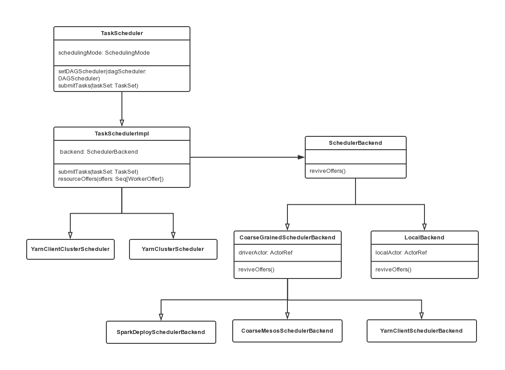

TaskScheduler介绍
TaskScheduler的主要任务是提交taskset到集群运算并汇报结果。
具体而言：

出现shuffle输出lost要报告fetch failed错误
碰到straggle任务需要放到别的节点上重试
为每个TaskSet维护一个TaskSetManager(追踪本地性及错误信息)
TaskScheduler创建
在《SparkContext源码解读》一文中，我介绍了在SparkContext初始化时创建TaskScheduler和DAGScheduler。这里具体描述一下其创建过程。

SparkContext创建过程中会调用createTaskScheduler函数来启动TaskScheduler任务调度器：
```scala
// Create and start the scheduler
  private[spark] var (schedulerBackend, taskScheduler) =
    SparkContext.createTaskScheduler(this, master)
```
  
createTaskScheduler函数中，TaskScheduler会根据部署方式而选择不同的SchedulerBackend来处理.
针对不同部署方式会有不同的TaskScheduler与SchedulerBackend进行组合：

以Standalone模式为例，backend根据不同的部署方式实例化，后又作为scheduler对象的一个成员变量对scheduler调用initialize函数：

case SPARK_REGEX(sparkUrl) =>
        val scheduler = new TaskSchedulerImpl(sc)
        val masterUrls = sparkUrl.split(",").map("spark://" + _)
        val backend = new SparkDeploySchedulerBackend(scheduler, sc, masterUrls)
        scheduler.initialize(backend)
        (backend, scheduler)
TaskScheduler、TaskSchedulerImpl、SchedulerBackend之间的关系
TaskScheduler类负责任务调度资源的分配，SchedulerBackend负责与Master、Worker通信收集Worker上分配给该应用使用的资源情况。
下图描述了TaskScheduler、TaskSchedulerImpl、SchedulerBackend之间的UML关系，其中TaskSchedulerImpl是task schduler的具体实现，其中混入了TaskScheduler特质，而SparkDeploySchedulerBackend等具体的资源收集类继承自CoarseGrainedSchedulerBackend这一父类，而CoarseGrainedSchedulerBackend混入了SchedulerBackend特质：

这里还是以Spark Standalone集群模式为例，分析TaskSchedulerImpl与SparkDepolySchedulerBackend类中的具体操作。

资源信息收集
SparkDepolySchedulerBackend类就是专门负责收集Worker的资源信息，在它的父类CoarseGrainedSchedulerBackend中的DriverEndpoint就是与Worker通信的Endpoint。
Worker启动后会向Driver发送RegisterExecutor消息，此消息中就包含了Executor为Application分配的计算资源信息，而接收该消息的Endpoint也正是DriverEndpoint。

资源分配
TaskSchedulerImpl类就是负责为Task分配资源的。在CoarseGrainedSchedulerBackend获取到可用资源后就会通过makeOffers方法通知TaskSchedulerImpl对资源进行分配，TaskSchedulerImpl的resourceOffers方法就是负责为Task分配计算资源的，在为Task分配好资源后又会通过lauchTasks方法发送LaunchTask消息通知Worker上的Executor执行Task。

TaskScheduler创建中函数调用链
SparkContext的createTaskScheduler创建schedulerBackend和taskScheduler-->根据不同的调度方式选择具体的scheduler和backend构造器-->调用TaskSchedulerImpl的initialize方法为scheduler的成员变量backend赋值-->createTaskScheduler返回创建好的(schedulerBackend, taskScheduler)-->调用TaskScheduler.start()启动-->实际上在TaskSchedulerImpl的start方法中调用backend.start()来启动SchedulerBackend。

TaskScheduler是在Application执行过程中，为它进行任务调度的，是属于Driver侧的。对应于一个Application就会有一个TaskScheduler，TaskScheduler和Application是一一对应的。TaskScheduler对资源的控制也比较鲁棒，一个Application申请Worker的计算资源，只要Application不结束就会一直被占有。


DAGScheduler中的submitMissingTasks函数
如果一个Stage的所有的parent stage都已经计算完成或者存在于cache中，那么他会调用submitMissingTasks来提交该Stage所包含的Tasks。
submitMissingTasks负责创建新的Task。
Spark将由Executor执行的Task分为ShuffleMapTask和ResultTask两种。
每个Stage生成Task的时候根据Stage中的isShuffleMap标记确定是否为ShuffleMapStage，如果标记为真，则这个Stage输出的结果会经过Shuffle阶段作为下一个Stage的输入，创建ShuffleMapTask；否则是ResultStage，这样会创建ResultTask，Stage的结果会输出到Spark空间；最后，Task是通过taskScheduler.submitTasks来提交的。

计算流程
submitMissingTasks的计算流程如下：

```scala
  /** Called when stage's parents are available and we can now do its task. */
  private def submitMissingTasks(stage: Stage, jobId: Int) {
    logDebug("submitMissingTasks(" + stage + ")")

    // First figure out the indexes of partition ids to compute.
    val partitionsToCompute: Seq[Int] = stage.findMissingPartitions()

    // Use the scheduling pool, job group, description, etc. from an ActiveJob associated
    // with this Stage
    val properties = jobIdToActiveJob(jobId).properties

    runningStages += stage
    // SparkListenerStageSubmitted should be posted before testing whether tasks are
    // serializable. If tasks are not serializable, a SparkListenerStageCompleted event
    // will be posted, which should always come after a corresponding SparkListenerStageSubmitted
    // event.
    stage match {
      case s: ShuffleMapStage =>
        outputCommitCoordinator.stageStart(stage = s.id, maxPartitionId = s.numPartitions - 1)
      case s: ResultStage =>
        outputCommitCoordinator.stageStart(
          stage = s.id, maxPartitionId = s.rdd.partitions.length - 1)
    }
    val taskIdToLocations: Map[Int, Seq[TaskLocation]] = try {
      stage match {
        case s: ShuffleMapStage =>
          partitionsToCompute.map { id => (id, getPreferredLocs(stage.rdd, id))}.toMap
        case s: ResultStage =>
          partitionsToCompute.map { id =>
            val p = s.partitions(id)
            (id, getPreferredLocs(stage.rdd, p))
          }.toMap
      }
    } catch {
      case NonFatal(e) =>
        stage.makeNewStageAttempt(partitionsToCompute.size)
        listenerBus.post(SparkListenerStageSubmitted(stage.latestInfo, properties))
        abortStage(stage, s"Task creation failed: $e\n${Utils.exceptionString(e)}", Some(e))
        runningStages -= stage
        return
    }

    stage.makeNewStageAttempt(partitionsToCompute.size, taskIdToLocations.values.toSeq)

    // If there are tasks to execute, record the submission time of the stage. Otherwise,
    // post the even without the submission time, which indicates that this stage was
    // skipped.
    if (partitionsToCompute.nonEmpty) {
      stage.latestInfo.submissionTime = Some(clock.getTimeMillis())
    }
    listenerBus.post(SparkListenerStageSubmitted(stage.latestInfo, properties))

    // TODO: Maybe we can keep the taskBinary in Stage to avoid serializing it multiple times.
    // Broadcasted binary for the task, used to dispatch tasks to executors. Note that we broadcast
    // the serialized copy of the RDD and for each task we will deserialize it, which means each
    // task gets a different copy of the RDD. This provides stronger isolation between tasks that
    // might modify state of objects referenced in their closures. This is necessary in Hadoop
    // where the JobConf/Configuration object is not thread-safe.
    var taskBinary: Broadcast[Array[Byte]] = null
    var partitions: Array[Partition] = null
    try {
      // For ShuffleMapTask, serialize and broadcast (rdd, shuffleDep).
      // For ResultTask, serialize and broadcast (rdd, func).
      var taskBinaryBytes: Array[Byte] = null
      // taskBinaryBytes and partitions are both effected by the checkpoint status. We need
      // this synchronization in case another concurrent job is checkpointing this RDD, so we get a
      // consistent view of both variables.
      RDDCheckpointData.synchronized {
        taskBinaryBytes = stage match {
          case stage: ShuffleMapStage =>
            JavaUtils.bufferToArray(
              closureSerializer.serialize((stage.rdd, stage.shuffleDep): AnyRef))
          case stage: ResultStage =>
            JavaUtils.bufferToArray(closureSerializer.serialize((stage.rdd, stage.func): AnyRef))
        }

        partitions = stage.rdd.partitions
      }

      taskBinary = sc.broadcast(taskBinaryBytes)
    } catch {
      // In the case of a failure during serialization, abort the stage.
      case e: NotSerializableException =>
        abortStage(stage, "Task not serializable: " + e.toString, Some(e))
        runningStages -= stage

        // Abort execution
        return
      case NonFatal(e) =>
        abortStage(stage, s"Task serialization failed: $e\n${Utils.exceptionString(e)}", Some(e))
        runningStages -= stage
        return
    }

    val tasks: Seq[Task[_]] = try {
      val serializedTaskMetrics = closureSerializer.serialize(stage.latestInfo.taskMetrics).array()
      stage match {
        case stage: ShuffleMapStage =>
          stage.pendingPartitions.clear()
          partitionsToCompute.map { id =>
            val locs = taskIdToLocations(id)
            val part = partitions(id)
            stage.pendingPartitions += id
            new ShuffleMapTask(stage.id, stage.latestInfo.attemptNumber,
              taskBinary, part, locs, properties, serializedTaskMetrics, Option(jobId),
              Option(sc.applicationId), sc.applicationAttemptId)
          }

        case stage: ResultStage =>
          partitionsToCompute.map { id =>
            val p: Int = stage.partitions(id)
            val part = partitions(p)
            val locs = taskIdToLocations(id)
            new ResultTask(stage.id, stage.latestInfo.attemptNumber,
              taskBinary, part, locs, id, properties, serializedTaskMetrics,
              Option(jobId), Option(sc.applicationId), sc.applicationAttemptId)
          }
      }
    } catch {
      case NonFatal(e) =>
        abortStage(stage, s"Task creation failed: $e\n${Utils.exceptionString(e)}", Some(e))
        runningStages -= stage
        return
    }


    logInfo(
      s"""
         | *********************** spark 2.4.1 submit missing tasks
         |
       """.stripMargin)
    if (tasks.size > 0) {
      logInfo(
        s"""Submitting ${tasks.size} missing tasks from $stage (${stage.rdd})
           |(first 15 tasks are for partitions ${tasks.take(15).map(_.partitionId)})""".stripMargin)
      val taskSet = new TaskSet(
        tasks.toArray, stage.id, stage.latestInfo.attemptNumber, jobId, properties)
      logInfo(
        s"""*************** spark 2.4.2
           |taskScheduler.submitTasks ${taskSet}
         """.stripMargin)
      taskScheduler.submitTasks(taskSet)
    } else {
      // Because we posted SparkListenerStageSubmitted earlier, we should mark
      // the stage as completed here in case there are no tasks to run
      markStageAsFinished(stage, None)

      val debugString = stage match {
        case stage: ShuffleMapStage =>
          s"Stage ${stage} is actually done; " +
            s"(available: ${stage.isAvailable}," +
            s"available outputs: ${stage.numAvailableOutputs}," +
            s"partitions: ${stage.numPartitions})"
        case stage : ResultStage =>
          s"Stage ${stage} is actually done; (partitions: ${stage.numPartitions})"
      }
      logInfo(debugString)

      submitWaitingChildStages(stage)
    }
  }

```

首先得到RDD中需要计算的partition，对于Shuffle类型的stage，需要判断stage中是否缓存了该结果；对于Result类型的Final Stage，则判断计算Job中该partition是否已经计算完成。
序列化task的binary。Executor可以通过广播变量得到它。每个task运行的时候首先会反序列化。这样在不同的executor上运行的task是隔离的，不会相互影响。
为每个需要计算的partition生成一个task：对于Shuffle类型依赖的Stage，生成ShuffleMapTask类型的task；对于Result类型的Stage，生成一个ResultTask类型的task。
确保Task是可以被序列化的。因为不同的cluster有不同的taskScheduler，在这里判断可以简化逻辑；保证TaskSet的task都是可以序列化的。
通过TaskScheduler提交TaskSet。
部分代码
下面是submitMissingTasks判断是否为ShuffleMapStage的部分代码，其中部分参数说明在注释中：

```scala
val tasks: Seq[Task[_]] = try {
      val serializedTaskMetrics = closureSerializer.serialize(stage.latestInfo.taskMetrics).array()
      stage match {
        case stage: ShuffleMapStage =>
          stage.pendingPartitions.clear()
          partitionsToCompute.map { id =>
            val locs = taskIdToLocations(id)
            val part = partitions(id)
            stage.pendingPartitions += id
            new ShuffleMapTask(stage.id, stage.latestInfo.attemptNumber,
              taskBinary, part, locs, properties, serializedTaskMetrics, Option(jobId),
              Option(sc.applicationId), sc.applicationAttemptId)
          }

        case stage: ResultStage =>
          partitionsToCompute.map { id =>
            val p: Int = stage.partitions(id)
            val part = partitions(p)
            val locs = taskIdToLocations(id)
            new ResultTask(stage.id, stage.latestInfo.attemptNumber,
              taskBinary, part, locs, id, properties, serializedTaskMetrics,
              Option(jobId), Option(sc.applicationId), sc.applicationAttemptId)
          }
      }
     
```
关于taskBinary参数：这是RDD和ShuffleDependency的广播变量(broadcase version)，作为序列化之后的结果。
这里将RDD和其依赖关系进行序列化，在executor运行task之前再进行反序列化。这种方式对不同的task之间提供了较好的隔离。

下面是submitMissingTasks进行任务提交的部分代码：

  ```scala
if (tasks.size > 0) {
      logInfo(
        s"""Submitting ${tasks.size} missing tasks from $stage (${stage.rdd})
           |(first 15 tasks are for partitions ${tasks.take(15).map(_.partitionId)})""".stripMargin)
      val taskSet = new TaskSet(
        tasks.toArray, stage.id, stage.latestInfo.attemptNumber, jobId, properties)
      logInfo(
        s"""*************** spark 2.4.2
           |taskScheduler.submitTasks ${taskSet}
         """.stripMargin)
      taskScheduler.submitTasks(taskSet)
    } else {
      // Because we posted SparkListenerStageSubmitted earlier, we should mark
      // the stage as completed here in case there are no tasks to run
      markStageAsFinished(stage, None)
```
TaskSchedulerImpl中的submitTasks
submitTasks的流程如下：

任务(tasks)会被包装成TaskSetManager（由于TaskSetManager不是线程安全的，所以源码中需要进行同步）
TaskSetManager实例通过schedulableBuilder（分为FIFOSchedulableBuilder和FairSchedulableBuilder两种）投入调度池中等待调度
任务提交同时启动定时器，如果任务还未被执行，定时器会持续发出警告直到任务被执行

调用backend的reviveOffers函数，向backend的driverEndpoint实例发送ReviveOffers消息，driveerEndpoint收到ReviveOffers消息后，调用makeOffers处理函数
```scala
  override def submitTasks(taskSet: TaskSet) {
    val tasks = taskSet.tasks
    logInfo("Adding task set " + taskSet.id + " with " + tasks.length + " tasks")
    this.synchronized {
      val manager = createTaskSetManager(taskSet, maxTaskFailures)
      activeTaskSets(taskSet.id) = manager
      schedulableBuilder.addTaskSetManager(manager, manager.taskSet.properties)

      if (!isLocal && !hasReceivedTask) {
        starvationTimer.scheduleAtFixedRate(new TimerTask() {
          override def run() {
            if (!hasLaunchedTask) {
              logWarning("Initial job has not accepted any resources; " +
                "check your cluster UI to ensure that workers are registered " +
                "and have sufficient resources")
            } else {
              this.cancel()
            }
          }
        }, STARVATION_TIMEOUT, STARVATION_TIMEOUT)
      }
      hasReceivedTask = true
    }
    
    // backed 唤醒请求
    backend.reviveOffers()
  }
```
TaskSetManager调度
每个Stage一经确认，生成相应的TaskSet（即为一组tasks），其对应一个TaskSetManager通过Stage回溯到最源头缺失的Stage提交到调度池pool中，在调度池中，这些TaskSetMananger又会根据Job ID排序，先提交的Job的TaskSetManager优先调度，然后一个Job内的TaskSetManager ID小的先调度，并且如果有未执行完的父母Stage的TaskSetManager，则不会提交到调度池中。

reviveOffers函数代码
下面是CoarseGrainedSchedulerBackend的reviveOffers函数：

   case ReviveOffers =>
          makeOffers()
driverEndpoint收到ReviveOffers消息后，调用makeOffers处理函数。

DriverEndpoint的makeOffers函数
makeOffers函数的处理逻辑是：

找到空闲的Executor，分发的策略是随机分发的，即尽可能将任务平摊到各个Executor
如果有空闲的Executor，就将任务列表中的部分任务利用launchTasks发送给指定的Executor
SchedulerBackend(这里实际是CoarseGrainedSchedulerBackend)负责将新创建的Task分发给Executor，从launchTasks代码中可以看出，在发送LauchTasks指令之前需要将TaskDescription序列化。

  ```scala
 private def makeOffers() {
      // Make sure no executor is killed while some task is launching on it
      val taskDescs = CoarseGrainedSchedulerBackend.this.synchronized {
        // Filter out executors under killing
        val activeExecutors = executorDataMap.filterKeys(executorIsAlive)
        val workOffers = activeExecutors.map {
          case (id, executorData) =>
            new WorkerOffer(id, executorData.executorHost, executorData.freeCores)
        }.toIndexedSeq
        scheduler.resourceOffers(workOffers)
      }
      if (!taskDescs.isEmpty) {
        launchTasks(taskDescs)
      }
    }
```
TaskSchedulerImpl中的resourceOffers函数
任务是随机分发给各个Executor的，资源分配的工作由resourceOffers函数处理。
正如上面submitTasks函数提到的，在TaskSchedulerImpl中，这一组Task被交给一个新的TaskSetManager实例进行管理，所有的TaskSetManager经由SchedulableBuilder根据特定的调度策略进行排序，在TaskSchedulerImpl的resourceOffers函数中，当前被选择的TaskSetManager的ResourceOffer函数被调用并返回包含了序列化任务数据的TaskDescription，最后这些TaskDescription再由SchedulerBackend派发到ExecutorBackend去执行。

resourceOffers主要做了3件事：

从Workers里面随机抽出一些来执行任务。
通过TaskSetManager找出和Worker在一起的Task，最后编译打包成TaskDescription返回。
将Worker-->Array[TaskDescription]的映射关系返回。
  ```scala
 /**
   * Called by cluster manager to offer resources on slaves. We respond by asking our active task
   * sets for tasks in order of priority. We fill each node with tasks in a round-robin manner so
   * that tasks are balanced across the cluster.
   */
  def resourceOffers(offers: IndexedSeq[WorkerOffer]): Seq[Seq[TaskDescription]] = synchronized {
    // Mark each slave as alive and remember its hostname
    // Also track if new executor is added
    var newExecAvail = false
    for (o <- offers) {
      if (!hostToExecutors.contains(o.host)) {
        hostToExecutors(o.host) = new HashSet[String]()
      }
      if (!executorIdToRunningTaskIds.contains(o.executorId)) {
        hostToExecutors(o.host) += o.executorId
        executorAdded(o.executorId, o.host)
        executorIdToHost(o.executorId) = o.host
        executorIdToRunningTaskIds(o.executorId) = HashSet[Long]()
        newExecAvail = true
      }
      for (rack <- getRackForHost(o.host)) {
        hostsByRack.getOrElseUpdate(rack, new HashSet[String]()) += o.host
      }
    }

    // Before making any offers, remove any nodes from the blacklist whose blacklist has expired. Do
    // this here to avoid a separate thread and added synchronization overhead, and also because
    // updating the blacklist is only relevant when task offers are being made.
    blacklistTrackerOpt.foreach(_.applyBlacklistTimeout())

    val filteredOffers = blacklistTrackerOpt.map { blacklistTracker =>
      offers.filter { offer =>
        !blacklistTracker.isNodeBlacklisted(offer.host) &&
          !blacklistTracker.isExecutorBlacklisted(offer.executorId)
      }
    }.getOrElse(offers)

    val shuffledOffers: IndexedSeq[WorkerOffer]
    = shuffleOffers(filteredOffers)
    // Build a list of tasks to assign to each worker.
    val tasks = shuffledOffers.map(o => new ArrayBuffer[TaskDescription](o.cores / CPUS_PER_TASK))
    val availableCpus = shuffledOffers.map(o => o.cores).toArray
    val sortedTaskSets = rootPool.getSortedTaskSetQueue
    for (taskSet <- sortedTaskSets) {
      logDebug("parentName: %s, name: %s, runningTasks: %s".format(
        taskSet.parent.name, taskSet.name, taskSet.runningTasks))
      if (newExecAvail) {
        taskSet.executorAdded()
      }
    }

    // Take each TaskSet in our scheduling order, and then offer it each node in increasing order
    // of locality levels so that it gets a chance to launch local tasks on all of them.
    // NOTE: the preferredLocality order: PROCESS_LOCAL, NODE_LOCAL, NO_PREF, RACK_LOCAL, ANY
    for (taskSet <- sortedTaskSets) {
      var launchedAnyTask = false
      var launchedTaskAtCurrentMaxLocality = false
      for (currentMaxLocality <- taskSet.myLocalityLevels) {
        do {
          launchedTaskAtCurrentMaxLocality = resourceOfferSingleTaskSet(
            taskSet, currentMaxLocality, shuffledOffers, availableCpus, tasks)
          launchedAnyTask |= launchedTaskAtCurrentMaxLocality
        } while (launchedTaskAtCurrentMaxLocality)
      }
      if (!launchedAnyTask) {
        taskSet.abortIfCompletelyBlacklisted(hostToExecutors)
      }
    }

    if (tasks.size > 0) {
      hasLaunchedTask = true
    }
    return tasks
  }
```
  
  
    // Take each TaskSet in our scheduling order, and then offer it each node in increasing order
    // of locality levels so that it gets a chance to launch local tasks on all of them.
    // NOTE: the preferredLocality order: PROCESS_LOCAL, NODE_LOCAL, NO_PREF, RACK_LOCAL, ANY
    // 随机遍历抽出来的worker，通过TaskSetManager的resourceOffer，把本地性最高的Task分给Worker
    // 本地性是根据当前的等待时间来确定的任务本地性的级别。
    // 它的本地性主要是包括四类：PROCESS_LOCAL, NODE_LOCAL, RACK_LOCAL, ANY。

    //1. 首先依次遍历 sortedTaskSets, 并对于每个 Taskset, 遍历 TaskLocality
    //2. 越 local 越优先, 找不到(launchedTask 为 false)才会到下个 locality 级别
    //3. (封装在resourceOfferSingleTaskSet函数)在多次遍历offer list,
    //因为一次taskSet.resourceOffer只会占用一个core, 
    //而不是一次用光所有的 core, 这样有助于一个 taskset 中的 task 比较均匀的分布在workers上
    //4. 只有在该taskset, 该locality下, 对所有worker offer都找不到合适的task时, 
    //才跳到下个 locality 级别
    var launchedTask = false
    for (taskSet <- sortedTaskSets; maxLocality <- taskSet.myLocalityLevels) {
      do {
        launchedTask = resourceOfferSingleTaskSet(
            taskSet, maxLocality, shuffledOffers, availableCpus, tasks)
      } while (launchedTask)
    }

    if (tasks.size > 0) {
      hasLaunchedTask = true
    }
    return tasks
  }
TaskDescription代码：

private[spark] class TaskDescription(
    val taskId: Long,
    val attemptNumber: Int,
    val executorId: String,
    val name: String,
    val index: Int,    // Index within this task's TaskSet
    _serializedTask: ByteBuffer)
  extends Serializable {

  // Because ByteBuffers are not serializable, wrap the task in a SerializableBuffer
  private val buffer = new SerializableBuffer(_serializedTask)

  def serializedTask: ByteBuffer = buffer.value

  override def toString: String = "TaskDescription(TID=%d, index=%d)".format(taskId, index)
}
DriverEndpoint的launchTasks函数
launchTasks函数流程：

launchTasks函数将resourceOffers函数返回的TaskDescription信息进行序列化
向executorEndpoint发送封装了serializedTask的LaunchTask消息
由于受到Akka Frame Size尺寸的限制，如果发送数据过大，会被截断。

```scala
// Launch tasks returned by a set of resource offers
    private def launchTasks(tasks: Seq[Seq[TaskDescription]]) {
      for (task <- tasks.flatten) {
        val serializedTask = TaskDescription.encode(task)
        if (serializedTask.limit() >= maxRpcMessageSize) {
          scheduler.taskIdToTaskSetManager.get(task.taskId).foreach { taskSetMgr =>
            try {
              var msg = "Serialized task %s:%d was %d bytes, which exceeds max allowed: " +
                "spark.rpc.message.maxSize (%d bytes). Consider increasing " +
                "spark.rpc.message.maxSize or using broadcast variables for large values."
              msg = msg.format(task.taskId, task.index, serializedTask.limit(), maxRpcMessageSize)
              taskSetMgr.abort(msg)
            } catch {
              case e: Exception => logError("Exception in error callback", e)
            }
          }
        }
        else {
          val executorData = executorDataMap(task.executorId)
          executorData.freeCores -= scheduler.CPUS_PER_TASK

          logInfo(s"""!!!!!!!!!!!!!!!!!!!!!!!! spark 3.2 scheduledBacked  send executor to LaunchTask
                  |Launching task ${task.taskId} on executor id: ${task.executorId} 
                  |hostname:${executorData.executorHost}""".stripMargin)

          executorData.executorEndpoint.send(LaunchTask(new SerializableBuffer(serializedTask)))
        }
      }
    }
```


ref：https://www.jianshu.com/p/4c2f1a52700c
