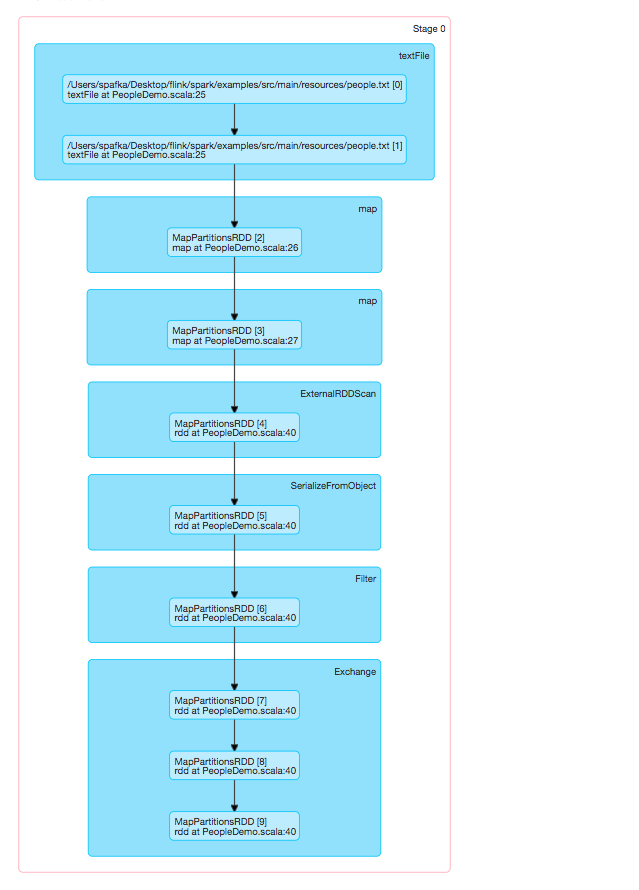
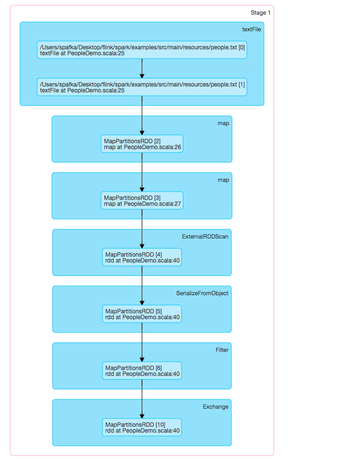
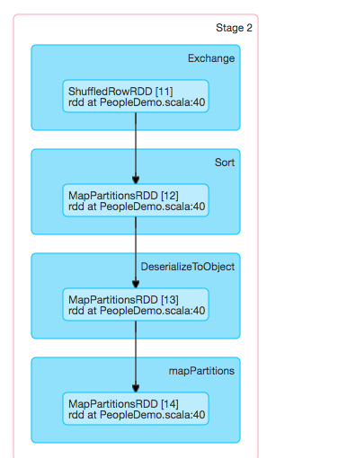
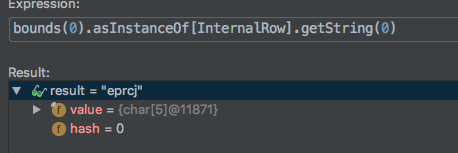
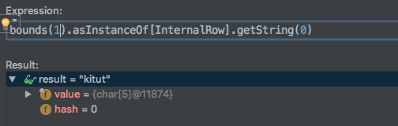
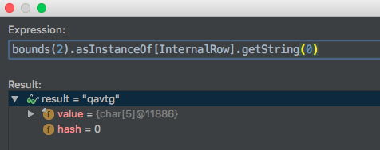
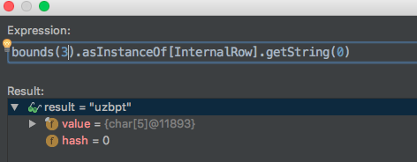

```scala

import org.apache.spark.sql.{DataFrame, Dataset}
case class Person(name: String, age: Int)
object PeopleDemo {
  def main(args: Array[String]): Unit = {

     val SHUFFLE_PARTITIONS = SQLConf.SHUFFLE_PARTITIONS.key
        val spark = SparkSession
          .builder()
          .appName("Spark SQL Example")
          .master("local[*]")
          .config(SHUFFLE_PARTITIONS, 5)
          .config("spark.sql.codegen.wholeStage", false)
          .getOrCreate()

        // For implicit conversions like converting RDDs to DataFrames
        import spark.implicits._
        val ds: Dataset[Person] = spark.sparkContext      .textFile("/Users/spafka/Desktop/flink/spark/examples/src/main/resources/people.txt")
          .map(_.split(","))
          .map(attributes => Person(attributes(0), attributes(1).trim.toInt))
          .toDS()
        ds.createOrReplaceTempView("people")
        val teenagersDF: DataFrame = spark.sql("SELECT name,age FROM people WHERE age <20 order by name asc,age desc ")

        //    import org.apache.spark.sql.execution.debug._
        //    teenagersDF.debug()
        //    teenagersDF.debugCodegen()
        val rows = teenagersDF.as[Person]
        // rows.explain()
        rows.rdd.collect().foreach(println)
        Thread.sleep(Int.MaxValue)
      }
   }

```

sql代码研究，这里只是一个最简单的sql查询，含filtter和order，其stage0



其stage1和stage0极度相似，是因为中间有order在局部排序时，有tearsort！！！而进行了采样。
[TearSort](http://dongxicheng.org/mapreduce/hadoop-terasort-analyse/)

其sparkPlan,其左边代表logicalplan，右边代表expression

```
c newInstance(class org.apache.spark.examples.sql.sql.Person), obj#11: org.apache.spark.examples.sql.sql.Person
+- Sort [name#3 ASC NULLS FIRST], true, 0
   +- Filter (age#4 < 20)
      +- SerializeFromObject [staticinvoke(class org.apache.spark.unsafe.types.UTF8String, StringType, fromString, assertnotnull(input[0, org.apache.spark.examples.sql.sql.Person, true]).name, true, false) AS name#3, assertnotnull(input[0, org.apache.spark.examples.sql.sql.Person, true]).age AS age#4]
         +- Scan ExternalRDDScan[obj#2]
```

看其如何转化成sparkPlan, 其类大多是logicalPlan+Exec ，执行doExecute

```scala

// product（投影）映射，是一个mapRDD
case class DeserializeToObjectExec(
    deserializer: Expression,
    outputObjAttr: Attribute,
    child: SparkPlan) extends UnaryExecNode with ObjectProducerExec with CodegenSupport {
override protected def doExecute(): RDD[InternalRow] = {

    child.execute().mapPartitionsWithIndexInternal { (index, iter) =>
    
      val projection: Projection = GenerateSafeProjection.generate(deserializer :: Nil, child.output)
    
      projection.initialize(index)
    
      iter.map(projection)
    
    }

  }
}  ```
```

SortExec 因为要tearsort，所以这里直接会有一个sample,在前面会有个prepare的过程，中间插入一个Exchange,[Spark SQL 物理计划的Shuffle实现](https://blog.csdn.net/u012684933/article/details/50731742),对于aggerate,order都会有exchange

此时sparkPlan

```Scala
Sort [name#3 ASC NULLS FIRST], true, 0
+- Exchange rangepartitioning(name#3 ASC NULLS FIRST, 200)
   +- Filter (age#4 < 20)
      +- SerializeFromObject [staticinvoke(class org.apache.spark.unsafe.types.UTF8String, StringType, fromString, assertnotnull(input[0, org.apache.spark.examples.sql.sql.Person, true]).name, true, false) AS name#3, assertnotnull(input[0, org.apache.spark.examples.sql.sql.Person, true]).age AS age#4]
         +- Scan ExternalRDDScan[obj#2]`
```
插入了一个rangepartitioning[Partitioner]的一个子类，另一个常见的就是HashPartitioner
```Scala
case class SortExec(
    sortOrder: Seq[SortOrder],
    global: Boolean,
    child: SparkPlan,
    testSpillFrequency: Int = 0)
  extends UnaryExecNode with CodegenSupport {

  ...
  def createSorter(): UnsafeExternalRowSorter = {
    val ordering = newOrdering(sortOrder, output)

    // The comparator for comparing prefix
    val boundSortExpression = BindReferences.bindReference(sortOrder.head, output)
    val prefixComparator = SortPrefixUtils.getPrefixComparator(boundSortExpression)

    val canUseRadixSort = enableRadixSort && sortOrder.length == 1 &&
      SortPrefixUtils.canSortFullyWithPrefix(boundSortExpression)

    // The generator for prefix
    val prefixExpr = SortPrefix(boundSortExpression)
    val prefixProjection = UnsafeProjection.create(Seq(prefixExpr))
    val prefixComputer = new UnsafeExternalRowSorter.PrefixComputer {
      private val result = new UnsafeExternalRowSorter.PrefixComputer.Prefix
      override def computePrefix(row: InternalRow):
          UnsafeExternalRowSorter.PrefixComputer.Prefix = {
        val prefix = prefixProjection.apply(row)
        result.isNull = prefix.isNullAt(0)
        result.value = if (result.isNull) prefixExpr.nullValue else prefix.getLong(0)
        result
      }
    }

    val pageSize = SparkEnv.get.memoryManager.pageSizeBytes
    val sorter = UnsafeExternalRowSorter.create(
      schema, ordering, prefixComparator, prefixComputer, pageSize, canUseRadixSort)

    if (testSpillFrequency > 0) {
      sorter.setTestSpillFrequency(testSpillFrequency)
    }
    sorter
  }

  // 此处进行的是全局排序(executor)执行，tearSort    
  protected override def doExecute(): RDD[InternalRow] = {
    val peakMemory = longMetric("peakMemory")
    val spillSize = longMetric("spillSize")
    val sortTime = longMetric("sortTime")

    child.execute().mapPartitionsInternal { iter =>
      val sorter = createSorter()

      val metrics = TaskContext.get().taskMetrics()
      // Remember spill data size of this task before execute this operator so that we can
      // figure out how many bytes we spilled for this operator.
      val spillSizeBefore = metrics.memoryBytesSpilled
      val sortedIterator = sorter.sort(iter.asInstanceOf[Iterator[UnsafeRow]])
      sortTime += sorter.getSortTimeNanos / 1000000
      peakMemory += sorter.getPeakMemoryUsage
      spillSize += metrics.memoryBytesSpilled - spillSizeBefore
      metrics.incPeakExecutionMemory(sorter.getPeakMemoryUsage)

      sortedIterator
    }
  }

  override def usedInputs: AttributeSet = AttributeSet(Seq.empty)

  override def inputRDDs(): Seq[RDD[InternalRow]] = {
    child.asInstanceOf[CodegenSupport].inputRDDs()
  }

...
```
```scala

private[spark] object RangePartitioner {

  private  val logger =LoggerFactory.getLogger(RangePartitioner.getClass)

  /**
   * Sketches the input RDD via reservoir sampling on each partition.
   * 采样
   * @param rdd the input RDD to sketch
   * @param sampleSizePerPartition max sample size per partition
   * @return (total number of items, an array of (partitionId, number of items, sampl
   */
  def sketch[K : ClassTag](
      rdd: RDD[K],
      sampleSizePerPartition: Int): (Long, Array[(Int, Long, Array[K])]) = {
    val shift = rdd.id
    // val classTagK = classTag[K] // to avoid serializing the entire partitioner object
    val sketched = rdd.mapPartitionsWithIndex { (idx, iter) =>
      val seed = byteswap32(idx ^ (shift << 16))
      val (sample, n) = SamplingUtils.reservoirSampleAndCount(
        iter, sampleSizePerPartition, seed)
      Iterator((idx, n, sample))
    }.collect()
    val numItems = sketched.map(_._2).sum

    logger.info(s"numItems =${numItems} sketched =${sketched}")
    (numItems, sketched)
  }

  /**
   * Determines the bounds for range partitioning from candidates with weights indicating how many
   * items each represents. Usually this is 1 over the probability used to sample this candidate.
   * 采样后划分partion的边界
   * @param candidates unordered candidates with weights
   * @param partitions number of partitions
   * @return selected bou
   */
  def determineBounds[K : Ordering : ClassTag](
      candidates: ArrayBuffer[(K, Float)],
      partitions: Int): Array[K] = {
    val ordering = implicitly[Ordering[K]]
    val ordered = candidates.sortBy(_._1)
    val numCandidates = ordered.size
    val sumWeights = ordered.map(_._2.toDouble).sum
    val step = sumWeights / partitions
    var cumWeight = 0.0
    var target = step
    val bounds = ArrayBuffer.empty[K]
    var i = 0s
    var j = 0
    var previousBound = Option.empty[K]
    while ((i < numCandidates) && (j < partitions - 1)) {
      val (key, weight) = ordered(i)
      cumWeight += weight
      if (cumWeight >= target) {
        // Skip duplicate values.
        if (previousBound.isEmpty || ordering.gt(key, previousBound.get)) {
          bounds += key
          target += step
          j += 1
          previousBound = Some(key)
        }
      }
      i += 1
    }


    val boundsArray = bounds.toArray

    logger.warn(
      s"""
         |+----------------------------------------------------------------------------+
         ||                  **  SPARK RANGER_PARTITIONER SAMPLING  **
         || rangeBounds=${boundsArray.mkString(", ")}
         |+----------------------------------------------------------------------------+
       """.stripMargin)


    boundsArray
  }
}


```
这里executor接收到driver划分的ShuffleRowRdd 对数据进行排序，其生成的代码，看其怎么是对name asc和age desc 排序。其生成 的字节码
```
18/03/23 15:22:42 262548 DEBUG org.apache.spark.sql.catalyst.expressions.codegen.GenerateOrdering:
 +----------------------------------------------------------+
 |    [[ SPARK SQL CODE GENERATOR  GENERATE_ORDERING ]]
 |     Executor task launch worker for task 2
 |     public SpecificOrdering generate(Object[] references) {
   return new SpecificOrdering(references);
 }

 class SpecificOrdering extends org.apache.spark.sql.catalyst.expressions.codegen.BaseOrdering {

   private Object[] references;


   public SpecificOrdering(Object[] references) {
     this.references = references;

   }

   public int compare(InternalRow a, InternalRow b) {

     InternalRow i = null;

     i = a;
     boolean isNullA;
     UTF8String primitiveA;
     {

       boolean isNull = i.isNullAt(0);
       UTF8String value = isNull ?
       null : (i.getUTF8String(0));
       isNullA = isNull;
       primitiveA = value;
     }
     i = b;
     boolean isNullB;
     UTF8String primitiveB;
     {

       boolean isNull = i.isNullAt(0);
       UTF8String value = isNull ?
       null : (i.getUTF8String(0));
       isNullB = isNull;
       primitiveB = value;
     }
     if (isNullA && isNullB) {
       // Nothing
     } else if (isNullA) {
       return -1;
     } else if (isNullB) {
       return 1;
     } else {
       int comp = primitiveA.compare(primitiveB);
       if (comp != 0) {
         return comp;
       }
     }

     i = a;
     boolean isNullA1;
     int primitiveA1;
     {

       int value1 = i.getInt(1);
       isNullA1 = false;
       primitiveA1 = value1;
     }
     i = b;
     boolean isNullB1;
     int primitiveB1;
     {

       int value1 = i.getInt(1);
       isNullB1 = false;
       primitiveB1 = value1;
     }
     if (isNullA1 && isNullB1) {
       // Nothing
     } else if (isNullA1) {
       return 1;
     } else if (isNullB1) {
       return -1;
     } else {
       int comp = (primitiveA1 > primitiveB1 ? 1 : primitiveA1 < primitiveB1 ? -1 : 0);
       if (comp != 0) {
         return -comp;
       }
     }


     return 0;
   }


 }
```






此时driver端接收到的rangeBound界定如图，tearSort第一阶段完成[partioner=5]

```Scala
/** Physical plan for Filter*/
case class FilterExec(condition: Expression, child: SparkPlan)
  extends UnaryExecNode with CodegenSupport with PredicateHelper {

  protected override def doExecute(): RDD[InternalRow] = {
    val numOutputRows = longMetric("numOutputRows")
    child.execute().mapPartitionsWithIndexInternal { (index, iter) =>
      val predicate = newPredicate(condition, child.output)
      predicate.initialize(0)
      iter.filter { row =>
        val r = predicate.eval(row)
        if (r) numOutputRows += 1
        r
      }
    }
  }
  override def outputOrdering: Seq[SortOrder] = child.outputOrdering
  override def outputPartitioning: Partitioning = child.outputPartitioning
}
```


生成的predicate class

```
scala
 public SpecificPredicate generate(Object[] references) {
   return new SpecificPredicate(references);
 }

 class SpecificPredicate extends org.apache.spark.sql.catalyst.expressions.codegen.Predicate {
   private final Object[] references;


   public SpecificPredicate(Object[] references) {
     this.references = references;

   }

   public void initialize(int partitionIndex) {

   }

   public boolean eval(InternalRow i) {

     boolean isNull = false;
     这是硬编码的函数，就像是自己手动写的一样
     int value1 = i.getInt(1);

     boolean value = false;
     value = value1 < 20;
     return !false && value;
   }


 }

```


```scala
case class SerializeFromObjectExec(
    serializer: Seq[NamedExpression],
    child: SparkPlan) extends ObjectConsumerExec with CodegenSupport {

  override def output: Seq[Attribute] = serializer.map(_.toAttribute)

  override def outputPartitioning: Partitioning = child.outputPartitioning

  override def inputRDDs(): Seq[RDD[InternalRow]] = {
    child.asInstanceOf[CodegenSupport].inputRDDs()
  }
  override protected def doExecute(): RDD[InternalRow] = {
    child.execute().mapPartitionsWithIndexInternal { (index, iter) =>
      val projection = UnsafeProjection.create(serializer)
      projection.initialize(index)
      iter.map(projection)
    }
  }
}
```
projection class  safeRow2unsafeRow

```
Code for  staticinvoke(class org.apache.spark.unsafe.types.UTF8String, StringType, fromString, assertnotnull(input[0, org.apache.spark.examples.sql.sql.Person, true]).name, true, false),assertnotnull(input[0, org.apache.spark.examples.sql.sql.Person, true]).age:

 public java.lang.Object generate(Object[] references) {
   return new SpecificUnsafeProjection(references);
 }

 class SpecificUnsafeProjection extends org.apache.spark.sql.catalyst.expressions.UnsafeProjection {

   private Object[] references;
   private boolean resultIsNull;
   private boolean globalIsNull;
   private org.apache.spark.sql.catalyst.expressions.codegen.BufferHolder[] mutableStateArray2 = new org.apache.spark.sql.catalyst.expressions.codegen.BufferHolder[1];
   private java.lang.String[] mutableStateArray = new java.lang.String[1];
   private org.apache.spark.sql.catalyst.expressions.codegen.UnsafeRowWriter[] mutableStateArray3 = new org.apache.spark.sql.catalyst.expressions.codegen.UnsafeRowWriter[1];
   private UnsafeRow[] mutableStateArray1 = new UnsafeRow[1];

   public SpecificUnsafeProjection(Object[] references) {
     this.references = references;

     mutableStateArray1[0] = new UnsafeRow(2);
     mutableStateArray2[0] = new org.apache.spark.sql.catalyst.expressions.codegen.BufferHolder(mutableStateArray1[0], 32);
     mutableStateArray3[0] = new org.apache.spark.sql.catalyst.expressions.codegen.UnsafeRowWriter(mutableStateArray2[0], 2);

   }

   public void initialize(int partitionIndex) {

   }

   // Scala.Function1 need this
   public java.lang.Object apply(java.lang.Object row) {
     return apply((InternalRow) row);
   }

   public UnsafeRow apply(InternalRow i) {
     mutableStateArray2[0].reset();

     mutableStateArray3[0].zeroOutNullBytes();


     UTF8String value4 = StaticInvoke(i);
     if (globalIsNull) {
       mutableStateArray3[0].setNullAt(0);
     } else {
       mutableStateArray3[0].write(0, value4);
     }


     boolean isNull6 = i.isNullAt(0);
     org.apache.spark.examples.sql.sql.Person value7 = isNull6 ?
     null : ((org.apache.spark.examples.sql.sql.Person)i.get(0, null));

     if (isNull6) {
       throw new NullPointerException(((java.lang.String) references[1] /* ));
     }
     boolean isNull4 = true;
     int value5 = -1;
     if (!false) {

       isNull4 = false;
       if (!isNull4) {
         value5 = value7.age();
       }
     }
     if (isNull4) {
       mutableStateArray3[0].setNullAt(1);
     } else {
       mutableStateArray3[0].write(1, value5);
     }
     mutableStateArray1[0].setTotalSize(mutableStateArray2[0].totalSize());
     return mutableStateArray1[0];
   }


   private UTF8String StaticInvoke(InternalRow i) {
     resultIsNull = false;
     if (!resultIsNull) {

       boolean isNull3 = i.isNullAt(0);
       org.apache.spark.examples.sql.sql.Person value3 = isNull3 ?
       null : ((org.apache.spark.examples.sql.sql.Person)i.get(0, null));

       if (isNull3) {
         throw new NullPointerException(((java.lang.String) references[0] /* ));
       }
       boolean isNull1 = true;
       java.lang.String value1 = null;
       if (!false) {

         isNull1 = false;
         if (!isNull1) {

           Object funcResult = null;
           funcResult = value3.name();

           if (funcResult != null) {
             value1 = (java.lang.String) funcResult;
           } else {
             isNull1 = true;
           }


         }
       }
       resultIsNull = isNull1;
       mutableStateArray[0] = value1;
     }

     boolean isNull = resultIsNull;
     UTF8String value = null;
     if (!resultIsNull) {
       value = org.apache.spark.unsafe.types.UTF8String.fromString(mutableStateArray[0]);
     }
     globalIsNull = isNull;
     return value;
   }

 }

```


Rdd -> Row() SpecificInternalRow[safe]

```Scala

/** Physical plan node for scanning data from a */
case class ExternalRDDScanExec[T](
    outputObjAttr: Attribute,
    rdd: RDD[T]) extends LeafExecNode with ObjectProducerExec {

  override lazy val metrics = Map(
    "numOutputRows" -> SQLMetrics.createMetric(sparkContext, "number of output rows"))

  protected override def doExecute(): RDD[InternalRow] = {
    val numOutputRows = longMetric("numOutputRows")
    val outputDataType = outputObjAttr.dataType
    rdd.mapPartitionsInternal { iter =>
      val outputObject = ObjectOperator.wrapObjectToRow(outputDataType)
      iter.map { value =>
        numOutputRows += 1
        outputObject(value)
      }
    }
  }

  override def simpleString: String = {
    s"Scan $nodeName${output.mkString("[", ",", "]")}"
  }
}
```

CodeGenerateTest
```
scala
public class Specific2UnsafeRow {

    public SpecificUnsafeProjection generate(Object[] references) {
        return new SpecificUnsafeProjection(references);
    }

    class SpecificUnsafeProjection extends UnsafeProjection {

        private Object[] references;
        private boolean resultIsNull;
        private boolean globalIsNull;
        private org.apache.spark.sql.catalyst.expressions.codegen.BufferHolder[] mutableStateArray2 = new org.apache.spark.sql.catalyst.expressions.codegen.BufferHolder[1];
        private java.lang.String[] mutableStateArray = new java.lang.String[1];
        private org.apache.spark.sql.catalyst.expressions.codegen.UnsafeRowWriter[] mutableStateArray3 = new org.apache.spark.sql.catalyst.expressions.codegen.UnsafeRowWriter[1];
        private UnsafeRow[] mutableStateArray1 = new UnsafeRow[1];

        public SpecificUnsafeProjection(Object[] references) {
            this.references = references;

            mutableStateArray1[0] = new UnsafeRow(2);
            mutableStateArray2[0] = new org.apache.spark.sql.catalyst.expressions.codegen.BufferHolder(mutableStateArray1[0], 32);
            mutableStateArray3[0] = new org.apache.spark.sql.catalyst.expressions.codegen.UnsafeRowWriter(mutableStateArray2[0], 2);

        }

        public void initialize(int partitionIndex) {

        }

        public UnsafeRow apply(InternalRow i) {
            mutableStateArray2[0].reset();

            mutableStateArray3[0].zeroOutNullBytes();


            UTF8String value4 = StaticInvoke(i);
            if (globalIsNull) {
                mutableStateArray3[0].setNullAt(0);
            } else {
                mutableStateArray3[0].write(0, value4);
            }


            boolean isNull6 = i.isNullAt(0);
            PeopleDemo.Person value7 = isNull6 ?
                    null : ((PeopleDemo.Person) i.get(0, null));

            if (isNull6) {
                throw new NullPointerException(((java.lang.String) references[1]));
            }
            boolean isNull4 = true;
            int value5 = -1;
            if (!false) {

                isNull4 = false;
                if (!isNull4) {
                    value5 = value7.age();
                }
            }
            if (isNull4) {
                mutableStateArray3[0].setNullAt(1);
            } else {
                mutableStateArray3[0].write(1, value5);
            }
            mutableStateArray1[0].setTotalSize(mutableStateArray2[0].totalSize());
            return mutableStateArray1[0];
        }


        private UTF8String StaticInvoke(InternalRow i) {
            resultIsNull = false;
            if (!resultIsNull) {

                boolean isNull3 = i.isNullAt(0);
                PeopleDemo.Person value3 = isNull3 ?
                        null : ((PeopleDemo.Person) i.get(0, null));

                if (isNull3) {
                    throw new NullPointerException(((java.lang.String) references[0]));
                }
                boolean isNull1 = true;
                java.lang.String value1 = null;
                if (!false) {

                    isNull1 = false;
                    if (!isNull1) {

                        Object funcResult = null;
                        funcResult = value3.name();

                        if (funcResult != null) {
                            value1 = (java.lang.String) funcResult;
                        } else {
                            isNull1 = true;
                        }


                    }
                }
                resultIsNull = isNull1;
                mutableStateArray[0] = value1;
            }

            boolean isNull = resultIsNull;
            UTF8String value = null;
            if (!resultIsNull) {
                value = org.apache.spark.unsafe.types.UTF8String.fromString(mutableStateArray[0]);
            }
            globalIsNull = isNull;
            return value;
        }

    }

    public static void main(String[] args) {
        Specific2UnsafeRow generatedClass = new Specific2UnsafeRow();
        SpecificUnsafeProjection x = generatedClass.generate(null);


        PeopleDemo.Person spafka = new PeopleDemo.Person("spafka", 1);
        Object[] p=   new Object[1];
        p[0]=spafka;
        UnsafeRow apply = x.apply(new GenericInternalRow(p));
        System.out.println(apply);

    }
```
more:

[探索Spark Tungsten的秘密](https://github.com/spafka/TungstenSecret)
[CodeGenerateTest](https://github.com/spafka/spark_deep/blob/master/spark-sql/src/main/scala/org/apache/spark/sql/catalyst/expressions/Specific2UnsafeRow.java)
[SparkSQL中的Sort实现](https://blog.csdn.net/asongoficeandfire/article/details/61668186)
[Spark SQL中的聚合（Aggregate）实现](https://blog.csdn.net/asongoficeandfire/article/details/69679684)
[Spark Tungsten-sort Based Shuffle 分析](https://www.jianshu.com/p/d328c96aebfd)